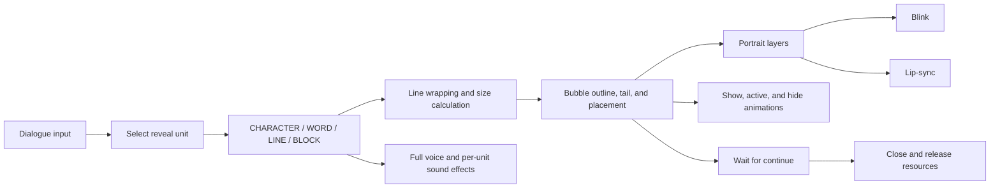
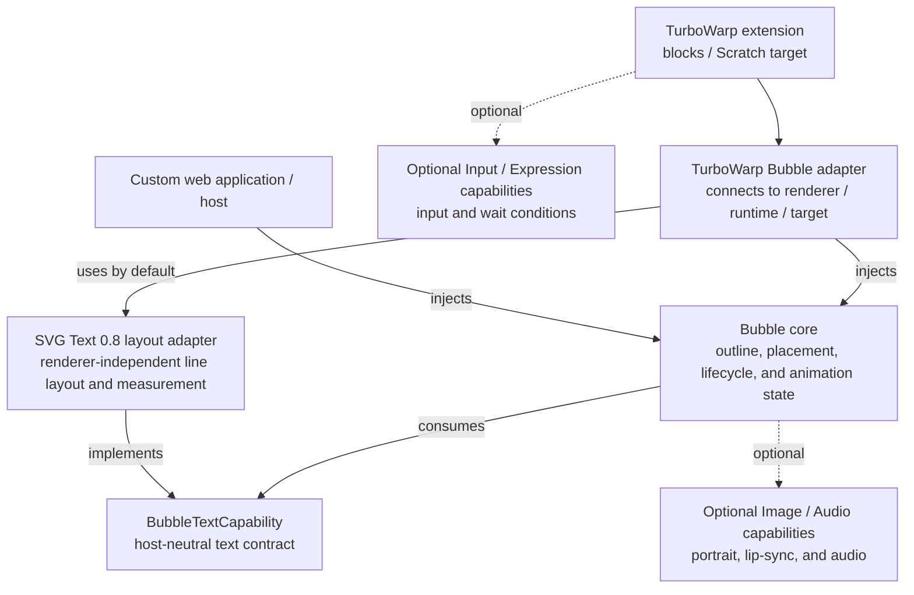
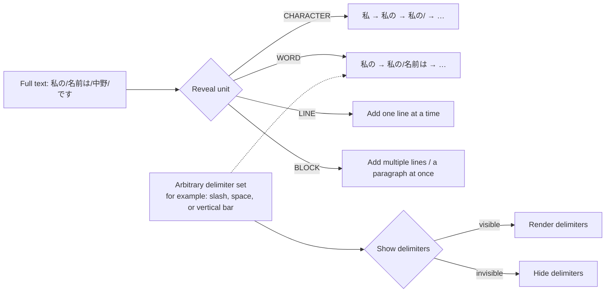
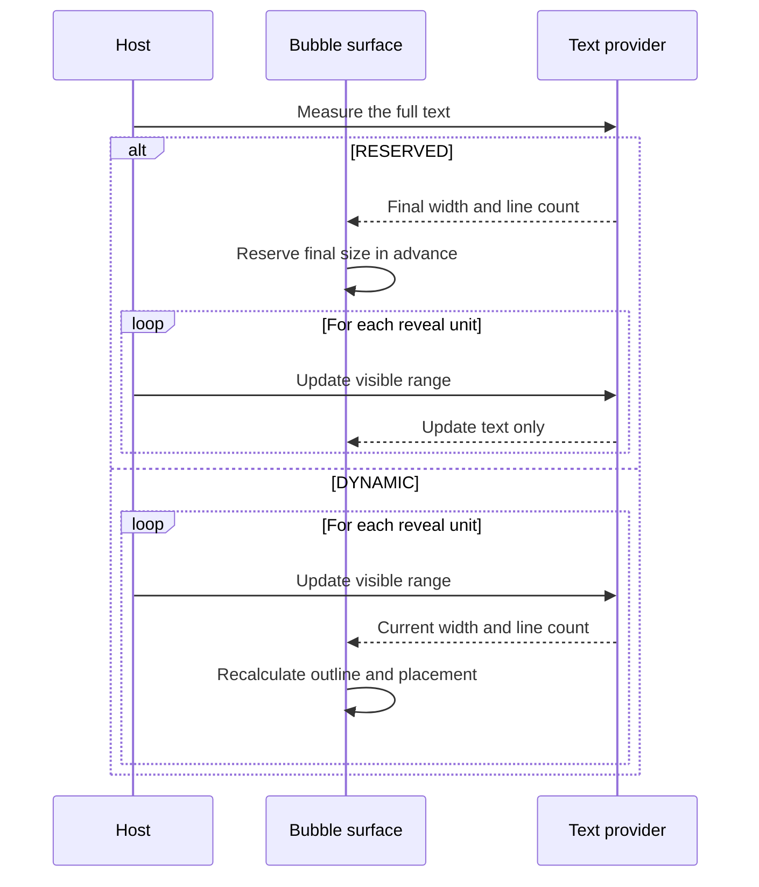
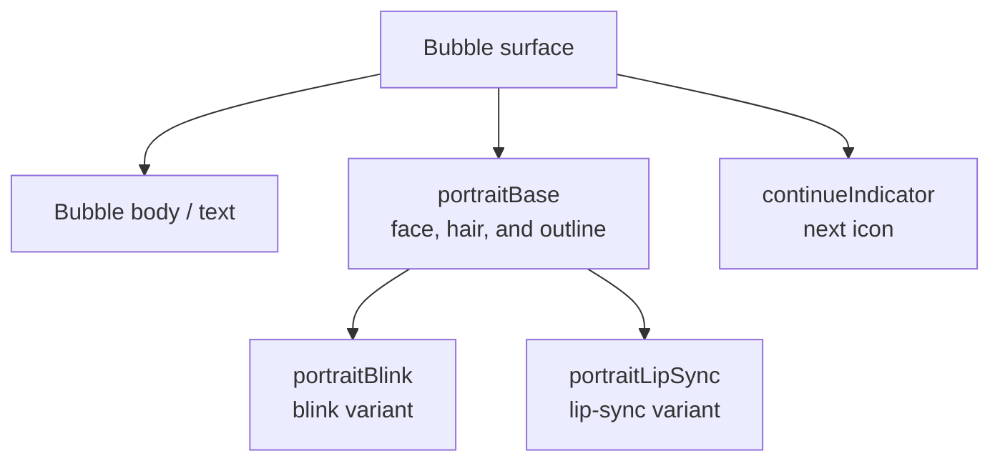
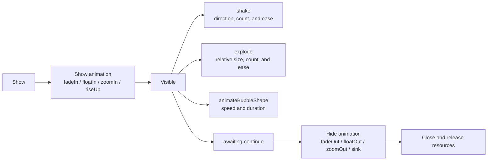

# TurboWarp Bubble

**English** | [日本語](README_ja.md)

`@kubohiroya/turbowarp-bubble` is an unsandboxed extension that manages TurboWarp `say` and `think` displays as separate text, character-expression, and input-waiting indicator layers. It also provides a composition API for using the same features directly from applications.

The current release is Bubble 0.8.0. Its default rendering path is the skin-free SVG overlay backed by SVG Text 0.8.1. For the complete TurboWarp feature set, the currently recommended companion releases are Asset Manager 0.12.1, Async Input 0.4.0, and Runtime Expression 0.4.0.

## How to read this README

Choose your environment first so that you only need to read the relevant sections.

1. To use blocks in TurboWarp, see [TurboWarp extension](#turbowarp-extension) and [Available blocks](#available-blocks).
2. To use Bubble from a custom web application or host, see [Composition API](#composition-api) and [Styles and display](#styles-and-display).
3. For the specifications of reveal units, line wrapping, shapes, portraits, and animations, see [Concepts and display specifications](#concepts-and-display-specifications).
4. See [Scratch compatibility](#scratch-compatibility) for availability in the official Scratch editor.

## Feature overview

Bubble combines a Text provider that draws text, a Bubble layer that manages the bubble outline and placement, and optional Asset capabilities that resolve images and audio. This lets the TurboWarp extension and compositions called by application hosts use the same display model.



The table below maps the 0.8.0 feature set to its public entry points. The standalone extension exposes 28 blocks generated from `src/block-definitions.json`; the full list appears under [Available blocks](#available-blocks).

| Area                              | What this README covers                                                                            | Public entry points                                      |
| --------------------------------- | -------------------------------------------------------------------------------------------------- | -------------------------------------------------------- |
| Text rendering and wrapping       | `BubbleTextCapability`, named styles, measured width, `maxWidth`, and UAX #14-compliant wrapping   | `composition`, `turbowarp-adapter`, and extension blocks |
| Progressive reveal                | `CHARACTER` / `WORD` / `LINE` / `BLOCK`, delimiters, per-unit sound effects, and finish conditions | `composition`, lightweight `reveal` entry, and blocks    |
| Portrait                          | Independent base-image, `blink`, and `lip-sync` layers                                             | Composition API and blocks through Asset Manager         |
| Bubble outline                    | Visual styles such as `NORMAL`, placement, tail, offset, and scale                                 | Composition API, TurboWarp adapter, and blocks           |
| Display mode                      | `talking` / `awaiting-continue` / `idle`                                                           | `BubbleHandle.setAnimationMode()` and the matching block |
| Show, active, and hide animations | `fadeIn`, `floatIn`, `shake`, `animateBubbleShape`, and others                                     | Style settings, `BubbleHandle.animate()`, and blocks     |

## Concepts and display specifications

### Three-layer architecture and responsibilities

The dependency structure places the pure Bubble composition at the center, with the TurboWarp adapter and each provider around it. Arrows point from the consumer to the dependency it uses.



In this architecture, Bubble core refers only to the host-neutral `BubbleTextCapability` contract. By default, the TurboWarp adapter calls `createSvgTextLayoutComposition().layoutText()` from its direct dependency, `@kubohiroya/turbowarp-svg-text@0.8.1`, to obtain line layout and text widths without creating SVG skins. When the standalone SVG Text 0.8.1 extension is already loaded, Bubble instead adapts its public `getLayoutCapability()` so styles defined by project blocks retain their font, color, size, and alignment. The bubble outline, tail, portrait placement, and show and hide animations are outside SVG Text's responsibilities. A Composition API host can inject a different implementation as `textCapability`. Image resolution, audio playback, input, and condition evaluation are also separated into capabilities; Asset Manager, Async Input, and Runtime Expression are connected only when their corresponding features are used.

### Rendering backend (SVG overlay by default)

The default value of `bubbleRenderBackend` is `"svg-overlay"`. Bubble places a shared SVG root over the stage canvas with `renderer.addOverlay(root, "scale")`, then renders the body, tail, text, portrait, corner clip, and continue indicator as DOM elements. Text uses host-neutral SVG Text 0.8.1 layout data, either from the loaded standalone extension's shared named-style registry or from Bubble's bundled fallback composition. On this default path, Bubble does not call `createDrawable()`, `createSVGSkin()`, or `createBitmapSkin()` to show bubbles, update text or styles, or run animations, so Bubble-originated work never enters scratch-render's `SVGSkin` / `Silhouette` path. `"scratch-render"` is used only when explicitly selected for compatibility or rollback.

When the stock Asset Manager 0.12.1 extension is loaded before Bubble in TurboWarp, Bubble calls `runtime.ext_kubohiroyaassetmanager.getDOMImageCapability()` the first time a portrait or another image feature is used. It then lazily connects to the same registry populated by Asset Manager blocks. Asset Manager is not loaded when only text is used. A Composition API host can inject capabilities explicitly as follows.

```ts
import { createAssetManagerComposition } from "@kubohiroya/turbowarp-asset-manager/composition";
import { createSvgTextLayoutComposition } from "@kubohiroya/turbowarp-svg-text/composition";
import {
  createAssetManagerSvgOverlayImageCapability,
  createSvgTextOverlayTextCapability,
  createTurboWarpBubbleComposition,
} from "@kubohiroya/turbowarp-bubble/turbowarp-adapter";

const assets = createAssetManagerComposition();
const textLayouts = createSvgTextLayoutComposition();

textLayouts.defineStyle({
  name: "dialogue-text",
  alignment: "left",
  backgroundColor: "transparent",
  font: "Helvetica",
  fontPercent: 100,
  textColor: "#575e75",
});

const bubbles = createTurboWarpBubbleComposition(runtime, {
  svgOverlayTextCapability: createSvgTextOverlayTextCapability(textLayouts),
  svgOverlayImageCapability:
    createAssetManagerSvgOverlayImageCapability(assets),
});
```

When `svgOverlayTextCapability` is omitted and standalone SVG Text 0.8.1 is loaded, Bubble obtains its frozen `getLayoutCapability()` and resolves the exact named-style registry populated by SVG Text blocks. If standalone SVG Text is absent, Bubble creates its own SVG Text 0.8.1 layout composition and initializes `default` and each first-referenced text-style name with transparent-background defaults. If an older standalone extension is present without the public handoff, Bubble reports `BUBBLE-RUNTIME-004` instead of silently replacing project styles; explicit `svgOverlayUnsupportedBehavior: "fallback"` selects scratch-render. Supplying a capability directly overrides both automatic paths. For portraits and similar features, Bubble's `createAssetManagerSvgOverlayImageCapability()` converts generic Asset Manager DOM resources into Bubble's image contract. The dependency points one way, from Bubble to Asset Manager; Asset Manager does not refer to Bubble types or security markers. The adapter exposes only MIME types allowed by both packages, carries across the validated MIME type, intrinsic size, `blob:` URL, and `release()`, and adds Bubble metadata to sanitized SVG from Asset Manager. Bubble never inserts arbitrary SVG strings. It reconstructs only allowed elements and attributes, such as `path` and `group`, from the canonical body by using `createElementNS()`. It rejects `script`, event handlers, `foreignObject`, and external URLs. The overlay root uses `pointer-events: none` and `aria-hidden="true"`.

The default text provider is the directly depended-on SVG Text 0.8.1. Preserving styles from a separately loaded stock SVG Text extension requires its 0.8.1 `getLayoutCapability()`. Automatic image connection between stock extensions requires Asset Manager 0.12.1 or later, which exposes `getDOMImageCapability()`. The lower-level path that explicitly injects `resolveDOMImageResource()` from the Composition API is available with Asset Manager 0.12.0 or later.

The skin-independent contracts for SVG Text and Asset Manager are published in [turbowarp-svg-text#26](https://github.com/kubohiroya/turbowarp-svg-text/issues/26), [turbowarp-asset-manager#103](https://github.com/kubohiroya/turbowarp-asset-manager/issues/103), and the stock registry handoff in [turbowarp-asset-manager#106](https://github.com/kubohiroya/turbowarp-asset-manager/issues/106). Bubble uses only public upstream APIs and never substitutes private-field access or extraction from skins. Selecting `svg-overlay` on a host without the overlay API returns `BUBBLE-RUNTIME-004`. Using images without either Asset Manager 0.12.1's public capability or an explicitly injected capability returns `BUBBLE-RUNTIME-002`. Bubble falls back to `scratch-render` on a host without the overlay API only when `svgOverlayUnsupportedBehavior: "fallback"` is explicitly specified.

| Host / capture method                      | `scratch-render` | `svg-overlay`                                                                            |
| ------------------------------------------ | ---------------- | ---------------------------------------------------------------------------------------- |
| TurboWarp Web / Desktop                    | Supported        | Supported when the overlay API and the public capabilities described above are available |
| TurboWarp Packager / player HTML           | Supported        | Supported under the same conditions when the packaged DOM can retain the overlay root    |
| Host without `renderer.addOverlay`         | Supported        | Explicit error by default; fallback only when configured                                 |
| OS screenshot / screen recording           | Included         | Included in the final browser composite                                                  |
| `renderer.canvas.toDataURL()` / `toBlob()` | Included         | Not included in the raw WebGL canvas                                                     |
| `renderer.canvas.captureStream()`          | Included         | Not included in the raw WebGL stream                                                     |

When the stage's native size changes, Bubble updates the root `viewBox` and every surface. Fullscreen and high-DPI CSS scaling are delegated to the renderer's `scale` overlay mode. On stop, project reload, target or clone destruction, or composition disposal, Bubble releases listeners, DOM nodes, and capability-owned resources. It calls `removeOverlay(root)` when the last Bubble is closed.

Automated regression tests verify that showing a Bubble, updating text, shaking it, and animating its shape with the default settings create zero Bubble-originated renderer skins or drawables. They also cover native-size updates, the shared root, upstream SVG Text 0.8.1 named-style coordinates and rounded corners, allowed attributes, and object URL release. The manual gates for visual parity and frame-time / memory behavior in Web, Desktop, and Packager are recorded in the [SVG overlay release notes](docs/release-notes-0.8.0.md).

### Progressive reveal units (CHARACTER / WORD / LINE / BLOCK)

Instead of only showing the entire line at once, Bubble can progressively add content one selected unit at a time. `CHARACTER` means a displayed grapheme cluster, not a morphological token, so combining characters and emoji are not split in the middle.

The spelling in the specification is `CHARACTER`, not `charactor`. `BLOCK` treats multiple lines, including line breaks, as one reveal unit; block here does not mean a Scratch block.



### WORD delimiters

Bubble does not perform Japanese morphological analysis. `WORD` is intended for languages separated by spaces or languages in which the user can insert delimiters. For example, enter `私の/名前は/中野/です`, set `/` as an invisible WORD delimiter, and the units appear in the order `私の` → `名前は` → `中野` → `です`. Making the delimiter visible preserves the slashes as part of the presentation.

Delimiters are not limited to one character; they can be specified as an arbitrary character set. You can choose whether to include each delimiter in the reveal unit or remove it before passing the text to the Text provider.

### DYNAMIC and RESERVED

Two bubble-sizing strategies are available during progressive reveal.



`RESERVED` keeps the outline more stable during reveal, while `DYNAMIC` avoids extra whitespace in short lines. `DYNAMIC` is the default layout. In `normalizeBubbleReveal` and the Composition API, the default `intervalSeconds` is `0`, which disables automatic advance; the extension block starts with `0.05` in its seconds field. Both layouts are independent of bubble-outline animations and portrait layers. The style's `reveal`, `handle.revealNext()`, and `handle.revealAll()` are the integration points for splitting and timing; a positive `intervalSeconds` enables automatic advance.

To reveal all remaining units before entering the waiting state, use a finish operation with an explicit reveal unit.

```text
finish [CHARACTER / WORD / LINE / BLOCK]
  with condition [CONDITION]
  or timeout after [TIMEOUT] seconds
```

When `CONDITION` becomes true, Bubble reveals every remaining unit. If it does not become true, the same completion process begins after `TIMEOUT` seconds. Set `TIMEOUT` to `0` for no time limit. On completion, Bubble can move to `awaiting-continue`, or the host can start `close` or the hide animation. Use `handle.finish({ unit, condition, timeoutSeconds })` in the Composition API or the `finish [UNIT] ...` block in the procedural extension. The block requires Runtime Expression; Async Input is needed as well only when input events update variables used by the condition.

### Audio and reveal units

`finish` is available as `handle.finish({ unit, condition, timeoutSeconds })` in the public Composition API and as the TurboWarp `finish [UNIT] ...` block. It completes progressive reveal and settles the audio and waiting state when the condition succeeds or the timeout expires.

When Asset Manager is connected as the audio provider, the following audio can share the same display lifecycle:

- Full voice playback when display starts
- A sound effect each time one `CHARACTER`, `WORD`, `LINE`, or `BLOCK` unit is revealed
- A finish cue after the Composition API's `finish` condition succeeds or its timeout expires

Per-unit effects play named audio assets; they do not synthesize the displayed string as speech. TurboWarp blocks expose voice and per-unit reveal sounds; `audio.finish` is currently a Composition API setting. Text, portraits, and the Bubble outline remain independently usable when no audio is provided.

### Package boundaries

| Package                                    | Responsibility                                                                                               |
| ------------------------------------------ | ------------------------------------------------------------------------------------------------------------ |
| `@kubohiroya/turbowarp-asset-manager`      | Connect optional Image / Audio capabilities to TurboWarp assets (image resolution and audio playback)        |
| Bubble core (`composition`)                | `BubbleTextCapability` contract, bubble surfaces, placement, progressive reveal, and animation               |
| `@kubohiroya/turbowarp-svg-text`           | Host-neutral plain / ruby layout, stock named-style handoff, and text-width measurement in version 0.8.1     |
| `@kubohiroya/turbowarp-async-input`        | Reflect key and tap input in Temporary Variables runtime variables                                           |
| `@kubohiroya/turbowarp-runtime-expression` | Safely evaluate wait conditions that refer to runtime variables                                              |
| `@kubohiroya/turbowarp-bubble`             | Bubble surfaces, placement, progressive reveal, say / think, expression layers, animation, and input waiting |
| Application / host                         | Convert application-specific input to Composition API calls as needed                                        |

Bubble does not re-export its dependencies. The lower-level Composition API requires `textCapability` as a contract and is not limited to SVG Text. The TurboWarp adapter uses the separately loaded SVG Text 0.8.1 named-style handoff when available, otherwise it creates the directly depended-on layout composition as its provider. Image, audio, input, and condition-evaluation capabilities are replaceable; the TurboWarp adapter connects Asset Manager lazily, while Composition API hosts can implement `imageResolver` and `audio` themselves. Features that use Asset Manager cover external media beyond images, including full voice clips, typewriter sounds, and per-line or per-paragraph effects.

### Automatic wrapping and line-breaking rules

For automatic wrapping with the optional `maxWidth`, Bubble uses `@cto.af/linebreak` to find Unicode UAX #14-compliant line-break opportunities. The dependency is contained behind the `LineBreakProvider` interface. Bubble measures text using the actual font and selects the last candidate that fits within the limit.

`UnicodeLineBreakProvider` restricts UAX #14 candidates to grapheme boundaries reported by `Intl.Segmenter`. In addition to applying line-start and line-end restrictions for punctuation and small kana, this prevents splitting combining characters or emoji. Explicit line breaks are preserved. Only strings with no valid break candidate, such as some URLs, fall back to splitting at grapheme boundaries.

```ts
import { wrapText } from "@kubohiroya/turbowarp-bubble/composition";

const layout = wrapText({
  text: "これは長いセリフです。",
  maxWidth: 320,
  measureText: (text) => textRenderer.measure(text),
});
```

Passing `maxWidth` and an optional `textLocale` in a Composition API Bubble style makes this `wrapText` foundation wrap the actual displayed string using the Text capability's `measureText`. If SVG Text or a host-provided Text capability does not provide `measureText`, displaying content with `maxWidth` produces an explicit capability error.


Every line in the figure is produced by calling the production `wrapText` implementation directly; the illustration does not use manually inserted line breaks.

### Bubble visual-style shapes

The available shapes are `NORMAL`, `THINKING`, `DREAMING`, `YELLING`, `OFF_PANEL`, `WAVY`, `WHISPERING`, `ANNOUNCEMENT`, `NARRATION`, and `NO_BUBBLE`.


This figure is generated with Bubble's shared `renderBubbleSvg`. For shapes with a triangular tail, the renderer finds the two tail-base points on the actual body border, unions the body polygon with the tail triangle using [platener/jsclipper](https://github.com/platener/jsclipper), and draws only the single resulting outline path. The round trails used by `THINKING` and `DREAMING` remain separate shapes.

In the standalone extension, select a shape with the `set bubble visual style` block. Both rendering backends use the shared `renderBubbleSvg`: the default overlay reconstructs its canonical SVG as allowlisted DOM elements, while explicit `scratch-render` mode applies an SVG skin to a dedicated drawable. In both cases the body stays behind the text and expressions. Actor-relative bubbles generate a tail pointing toward the Actor; background-relative bubbles have no tail. `NO_BUBBLE` hides the body and displays only the text, expressions, and other content. `NEGATIVE` can be represented using the fill and border colors, so it is not a separate style; orientation and segments are not exposed as inputs either.

A portrait can be placed at `left`, `right`, `top-left`, `top-right`, `bottom-left`, or `bottom-right`, with a portrait-specific `[x, y, zoom]` and corner radius. Placement defaults to `left`, the transform defaults to `[0, 0, 100]`, and corner radius defaults to `0`. Zoom must be greater than zero, and corner radius cannot be negative. In the standalone extension, use `set portrait [PLACEMENT] offset x [X] y [Y] zoom [ZOOM] % corner radius [RADIUS] px ...`; select `none` to remove the entire portrait. In the Composition API, include it in the style as follows.

```ts
portrait: {
  base: "HeroFace",
  placement: "top-left",
  offset: [-4, 6, 120],
  cornerRadius: 12,
}
```

See [THIRD_PARTY_NOTICES.md](THIRD_PARTY_NOTICES.md) for the licenses of dependencies included in the distributed bundle.

## Usage

### Installation

```sh
pnpm add @kubohiroya/turbowarp-bubble
```

With npm, install the same dependency as follows.

```sh
npm install @kubohiroya/turbowarp-bubble
```

Consumers that need only progressive-reveal normalization and string splitting can import the small `reveal` entry point without including the entire Bubble composition.

```ts
import {
  normalizeBubbleReveal,
  splitBubbleText,
} from "@kubohiroya/turbowarp-bubble/reveal";

const reveal = normalizeBubbleReveal({ unit: "CHARACTER" });
const chunks = splitBubbleText("A👩‍🚀B", reveal);
```

SVG Text 0.8.1 is included as a regular dependency and serves as the default skin-independent text provider. You do not need to install it separately. Loading the standalone SVG Text 0.8.1 extension first is optional, but doing so lets Bubble reuse styles defined by its project blocks through the public handoff. Bubble's declared optional peer ranges remain `>=0.7.0 <1` for Asset Manager and `>=0.3.0 <1` for both Async Input and Runtime Expression; the currently published and recommended extension versions are Asset Manager 0.12.1, Async Input 0.4.0, and Runtime Expression 0.4.0. Even when a host injects a custom `svgOverlayTextCapability`, Bubble's own SVG Text dependency remains fixed at version 0.8.1.

After rolling back to `bubbleRenderBackend: "scratch-render"`, Bubble creates a skin-based provider from the same 0.8.1 dependency if the standalone SVG Text extension is not loaded. On a host where the standalone SVG Text extension is already loaded, Bubble continues using that existing provider for compatibility.

Add Asset Manager to use image portraits, lip-sync, continue indicators, or audio assets. The `finish [UNIT] ...` block requires Runtime Expression. The integrated `wait with this bubble ...` block requires both Async Input and Runtime Expression.

```sh
pnpm add @kubohiroya/turbowarp-asset-manager \
  @kubohiroya/turbowarp-async-input \
  @kubohiroya/turbowarp-runtime-expression
```

```sh
npm install @kubohiroya/turbowarp-asset-manager \
  @kubohiroya/turbowarp-async-input \
  @kubohiroya/turbowarp-runtime-expression
```

### TurboWarp extension

For instructions covering block assembly, preparation of expression variants, input waiting, clones, and troubleshooting, see the block manual ([English](https://kubohiroya.github.io/turbowarp-bubble/) / [日本語](https://kubohiroya.github.io/turbowarp-bubble/ja/)). It also includes an animation example covering `talking`, the transition to `awaiting-continue`, successful input, and `close`.

In the Kamishibai DSL 4.0 combined bundle, open this manual with the documentation button directly below the **Bubble** member heading. The bundled palette keeps the same style, placement, portrait, reveal, audio, wait, animation, clone, and cleanup behavior; its member namespace and Bubble icon identify the originating extension.

#### Loading in TurboWarp

TurboWarp Bubble's `dist/turbowarp-bubble.js` is an **unsandboxed custom extension** that connects to TurboWarp's renderer and target APIs. Load it in the TurboWarp Editor in this order:

1. For the input-wait example, open your project in the TurboWarp Editor and add Temporary Variables from the extension library.
2. Select “Custom Extension” and enable Run without sandbox.
3. Load Asset Manager 0.12.1 if you use portraits, blinking, lip-sync, continue frames, or audio.
4. Load Runtime Expression 0.4.0 for `finish [UNIT] ...`; load both Async Input 0.4.0 and Runtime Expression 0.4.0 for `wait with this bubble until condition ...`.
5. Load Bubble 0.8.0 last. The SVG Text 0.8.1 layout provider is included in the Bubble bundle.

Bubble alone is the minimum configuration for text-only use. Temporary Variables, Asset Manager, Async Input, and Runtime Expression can be omitted when you do not use the features they support. After loading the extensions, place a `define bubble style` block followed by a `say` or `think` block. A text style can be `default` or any name; the standalone default provider initializes it with transparent-background SVG Text defaults.

```text
# Add only when using portraits, blink, lip-sync, continue, or audio
https://cdn.jsdelivr.net/npm/@kubohiroya/turbowarp-asset-manager@0.12.1/dist/asset-manager.js

# Add Async Input for the integrated wait block
https://cdn.jsdelivr.net/npm/@kubohiroya/turbowarp-async-input@0.4.0/dist/async-input.js

# Add Runtime Expression for finish or the integrated wait block
https://cdn.jsdelivr.net/npm/@kubohiroya/turbowarp-runtime-expression@0.4.0/dist/runtime-expression.js

# Bubble (always load last)
https://cdn.jsdelivr.net/npm/@kubohiroya/turbowarp-bubble@0.8.0/dist/turbowarp-bubble.js
```

TurboWarp custom extensions load JavaScript from URLs, so a network connection is required the first time they are loaded. During development, you can serve this repository through a local HTTP server and specify `dist/turbowarp-bubble.js`. The extension does not work when opened directly with `file://` or when run as a sandboxed extension.

#### Scratch compatibility

TurboWarp Bubble cannot be used directly as a custom extension in the official Scratch editor (Scratch 3.0). The official Scratch editor does not expose TurboWarp's unsandboxed extension, internal renderer, or target drawable APIs. Adding the URL from this README to a Scratch `.sb3` project does not register Bubble's blocks.

Support by environment is summarized below.

| Environment                             | Usage                                                                                      | Support                                |
| --------------------------------------- | ------------------------------------------------------------------------------------------ | -------------------------------------- |
| TurboWarp Editor                        | Load `dist/turbowarp-bubble.js` as an unsandboxed custom extension                         | Supported                              |
| TurboWarp Packager / compatible runtime | Load it in an environment that provides unsandboxed custom extensions and the renderer API | Supported (verify in each environment) |
| Official Scratch editor                 | Load it as an official or sandboxed extension                                              | Not supported                          |
| Custom web application / host           | Use the npm Composition API or TurboWarp adapter from JavaScript                           | Supported                              |

To use Bubble in another Scratch-compatible runtime, that runtime must implement the same unsandboxed APIs and renderer contract as TurboWarp. In a custom web application, use `@kubohiroya/turbowarp-bubble/composition` or `@kubohiroya/turbowarp-bubble/turbowarp-adapter` instead of the TurboWarp block extension.

Bubble owns a display for each calling sprite, clone, or Stage. With the default backend, the SVG body, text, expression base, blink layer, lip-sync layer, and continue icon are created as layers in the shared overlay DOM, so you do not need to add layer sprites to the project. The Stage can display only styles that use background-relative placement.

#### Available blocks

| Block                                                                                                          | Behavior                                                             |
| -------------------------------------------------------------------------------------------------------------- | -------------------------------------------------------------------- |
| `define bubble style [STYLE] using text style [TEXT_STYLE]`                                                    | Defines or replaces a Bubble style                                   |
| `set bubble placement [PLACEMENT] for bubble style [STYLE]`                                                    | Sets an Actor-relative direction/angle or background-relative region |
| `set portrait base [ASSET] for bubble style [STYLE]`                                                           | Sets the portrait base; an empty value removes the entire portrait   |
| `set portrait [PLACEMENT] offset x [X] y [Y] zoom [ZOOM] % corner radius [RADIUS] px for bubble style [STYLE]` | Sets portrait placement, local transform, and rounded corners        |
| `set bubble distance [DISTANCE] for bubble style [STYLE]`                                                      | Sets the distance from Actor bounds to the tail tip                  |
| `set bubble visual style [VISUAL_STYLE] for bubble style [STYLE]`                                              | Selects one of ten SVG body shapes                                   |
| `set bubble tail length [LENGTH] for bubble style [STYLE]`                                                     | Sets the nominal length from the body border to the tail tip         |
| `set bubble offset x [X] y [Y] scale [SCALE] % for bubble style [STYLE]`                                       | Sets the body offset and whole-Bubble scale                          |
| `set blink frames [ASSETS] every [SECONDS] seconds for bubble style [STYLE]`                                   | Sets blink frames and interval                                       |
| `set lip-sync frames [ASSETS] every [SECONDS] seconds for bubble style [STYLE]`                                | Sets lip-sync frames and interval                                    |
| `set continue frames [ASSETS] every [SECONDS] seconds for bubble style [STYLE]`                                | Sets the animation shown in `awaiting-continue`                      |
| `set bubble reveal unit [UNIT] every [SECONDS] seconds layout [LAYOUT] for bubble style [STYLE]`               | Configures CHARACTER/WORD/LINE/BLOCK progressive reveal              |
| `set bubble word delimiters [DELIMITERS] show [SHOW] for bubble style [STYLE]`                                 | Configures WORD delimiters and their visibility                      |
| `set bubble reveal sound [ASSET] for bubble style [STYLE]`                                                     | Sets the per-unit reveal sound                                       |
| `set bubble voice [ASSET] for bubble style [STYLE]`                                                            | Sets full voice played when display starts                           |
| `finish [UNIT] with condition [CONDITION] or timeout after [TIMEOUT] seconds`                                  | Reveals remaining units and waits for a condition or timeout         |
| `set bubble show animation [MOTION] for [SECONDS] seconds for bubble style [STYLE]`                            | Configures the show animation                                        |
| `set bubble hide animation [MOTION] for [SECONDS] seconds for bubble style [STYLE]`                            | Configures the hide animation                                        |
| `animate this bubble [MOTION]`                                                                                 | Plays a whole-Bubble animation                                       |
| `shake this bubble direction [DIRECTION] count [COUNT] ease [EASE]`                                            | Shakes the complete Bubble surface                                   |
| `explode this bubble relative scale [SCALE] count [COUNT] ease [EASE]`                                         | Applies relative-scale cycles to the Bubble                          |
| `animate bubble shape to [VISUAL_STYLE] speed [SPEED] for [SECONDS] seconds`                                   | Transitions the Bubble outline                                       |
| `say [MESSAGE] with bubble style [STYLE]`                                                                      | Starts or replaces a `say` Bubble in `talking` mode                  |
| `think [MESSAGE] with bubble style [STYLE]`                                                                    | Starts or replaces a `think` Bubble in `talking` mode                |
| `set this bubble animation mode [MODE]`                                                                        | Selects `talking`, `awaiting-continue`, or `idle`                    |
| `wait with this bubble until condition [CONDITION] or timeout after [TIMEOUT] seconds`                         | Waits for a Runtime Expression condition or optional timeout         |
| `close this bubble`                                                                                            | Releases this target's Bubble and owned resources                    |
| `Bubble version`                                                                                               | Returns the implementation version                                   |

`ASSETS` is a comma-separated list of names registered with Asset Manager; surrounding whitespace is removed, and names cannot contain commas. Blink and lip-sync accept one or more frames, continue indicators require at least two, and an empty list removes the setting. Frame intervals must be finite and greater than zero. Reveal intervals, animation durations, and timeouts accept zero; a zero reveal interval disables automatic advance, while a zero timeout disables the time limit.

The default visual style is `NORMAL`. With the default `svg-overlay` backend, the body is an SVG DOM layer behind the text and portrait in the shared overlay root. Explicit `scratch-render` mode instead uses an SVG skin and renderer drawable. Closing or replacing a Bubble, stopping its target, or disposing the runtime releases whichever resources the selected backend owns.

#### Placement

`PLACEMENT` has two families: Actor-relative and background-relative. The default is `up-right`.

- Actor-relative: one of 16 canonical direction names, a compass alias, or an angle from 0 to 360 degrees following Scratch directions. `0` is up, `90` is right, `180` is down, `270` is left, and `360` is normalized to `0`. Arbitrary angles are not rounded to one of the 16 named directions.
- Background-relative: `HEADER_LIKE`, `CENTER`, or `FOOTER_LIKE`. These center the Bubble horizontally at the top, center, or bottom of the Stage safe area and do not depend on the Actor's position, bounds, or visibility.

The 16 canonical Actor-relative direction names are listed below. Aliases are case-insensitive and are converted to their canonical names.

| Canonical name     | Compass alias     | Canonical name   | Compass alias     |
| ------------------ | ----------------- | ---------------- | ----------------- |
| `up`               | `north`           | `down`           | `south`           |
| `up-up-right`      | `north-northeast` | `down-down-left` | `south-southwest` |
| `up-right`         | `northeast`       | `down-left`      | `southwest`       |
| `right-up-right`   | `east-northeast`  | `left-down-left` | `west-southwest`  |
| `right`            | `east`            | `left`           | `west`            |
| `right-down-right` | `east-southeast`  | `left-up-left`   | `west-northwest`  |
| `down-right`       | `southeast`       | `up-left`        | `northwest`       |
| `down-down-right`  | `south-southeast` | `up-up-left`     | `north-northwest` |


Each of the 16 directions in the figure shows an Actor, the actual Bubble outline, its tail, and its text. The body and tail form one path through a JSClipper union, so there is no internal border line at the join. The three background-relative examples show the Stage border, safe area, outline dimensions, horizontal centerline, and reference edge or center. Both the figure and the rendered body in the TurboWarp Editor are generated from the shared `renderBubbleSvg`.


Actor-relative `distance` runs from the Actor's Stage-coordinate AABB (the axis-aligned bounding box represented by the top, bottom, left, and right values returned by the renderer's `getBoundsForBubble()`) to the tail tip. Its default is `12`. `tail length` runs from the body border at the normal position to the tail tip. Its default is `18`.

The default `offset x/y/scale` is `[0, 0, 100]`. Positive x points right, and positive y points up. Scale applies as one transformation to the Bubble outline, SVG Text content and font size, expression images, continue icon, and inner padding. When only scale changes, Bubble moves the body center away from the Actor by the radius of the size increase, preserving the Actor-side gap. It then applies the x/y offset and regenerates the tail toward its fixed tip, so the resulting length after the offset can differ from `tail length`. At Stage edges, the full Bubble is clamped to remain onscreen. These three settings are ignored for background-relative placement.

#### Portrait, blink, and lip-sync

A portrait is a set of layered, pre-aligned transparent images. Prepare the base and variant images with the same canvas size and center point to update only the eyes and mouth without redrawing the face.



| Layer               | Behavior while displayed                               | Configuration block / API                   |
| ------------------- | ------------------------------------------------------ | ------------------------------------------- |
| `portraitBase`      | Base image that remains visible                        | `set portrait base` / `portrait.base`       |
| `portraitBlink`     | Loops in `talking`, `awaiting-continue`, and `idle`    | `set blink frames` / `portrait.blink`       |
| `portraitLipSync`   | Loops only in `talking`; stops and hides while waiting | `set lip-sync frames` / `portrait.lipSync`  |
| `continueIndicator` | Loops only in `awaiting-continue`                      | `set continue frames` / `continueIndicator` |

Blink and lip-sync can each use a single still image. The keyword `lip-sync` consistently means a mouth-expression variant, not the entire act of speaking. `continue` is an icon animation that represents waiting for input; it does not execute the JavaScript `continue` statement.


#### Bubble animation

Bubble treats image-frame loops (blink, lip-sync, and continue) separately from transformations of the Bubble surface itself. The currently published `set this bubble animation mode` switches the behavior mode of the frame loops. Surface transformations form a general animation specification applied to the same surface.



##### Show and hide

Following PowerPoint terminology as a reference, Bubble calls these “show animations” and “hide animations.” Show animations include `fadeIn`, `floatIn`, `zoomIn`, and `riseUp`; hide animations include `fadeOut`, `floatOut`, `zoomOut`, and `sink`. They are not restricted to `RESERVED`. They can also be applied to a Bubble whose displayed size changes under `DYNAMIC`; a hide animation calculates its endpoint from the current outline.

##### Transformations while visible

- `shake + direction + count + ease`: Shakes the entire Bubble in the selected direction. `direction` can be horizontal, vertical, or diagonal; `count` is the number of round trips, and `ease` is the timing curve for each round trip.
- `explode + relativeScale + count + ease`: Repeatedly scales up and back down relative to the current size. The same relative transformation applies to the entire surface, including the portrait and Text.
- `animateBubbleShape + speed + duration`: Changes among outlines such as `THINKING`, `DREAMING`, `YELLING`, `WAVY`, and `WHISPERING` at the selected speed and for the selected duration. This separates changes to `visualStyle` from active surface animation.

The TurboWarp adapter advances each animation on scheduler ticks of up to 16 ms and applies `ease` to each frame's progress. The default SVG overlay changes the shared surface group's opacity and transform; explicit `scratch-render` mode maps the same motions to renderer effects, position, and scale. `shake` performs the requested number of round trips, while `explode` repeatedly enlarges and restores the Text, portrait, and body together. A `shake` or `explode` without `durationSeconds` uses a default duration based on its count.

`animateBubbleShape` cross-fades the current and requested outlines generated by `renderBubbleSvg` on every frame. The overlay backend rebuilds only the allowlisted body elements, while `scratch-render` updates the body skin; neither path regenerates the Text or portrait. `speed` is the shape-transition speed multiplier within the selected duration.

Animations integrate with the lifecycle of `show`, `handle.animate()`, `handle.setAnimationMode()`, `handle.updateStyle()`, and `handle.close()`. When a new Bubble replaces the same `actorKey`, the old animation timers and backend-owned rendering resources are released first. `shake` accepts `ease`; `explode` accepts `relativeScale`, `count`, and `ease`; and `animateBubbleShape` accepts `speed` and `durationSeconds`.

#### Animation mode

| Mode                | Blink   | Lip-sync           | Continue frames    |
| ------------------- | ------- | ------------------ | ------------------ |
| `talking`           | Running | Running            | Hidden             |
| `awaiting-continue` | Running | Stopped and hidden | Looping            |
| `idle`              | Running | Stopped and hidden | Stopped and hidden |

The `say` and `think` blocks start displaying in `talking` mode and immediately proceed to the next block. `wait with this bubble ...` automatically moves to `awaiting-continue` and evaluates runtime variables updated by Async Input through Runtime Expression. When the condition succeeds or the timeout expires, it moves to `idle` and proceeds to the next block.

#### Block example

```text
define bubble style [hero-dialogue] using text style [default]
set bubble placement [up-right] for bubble style [hero-dialogue]
set bubble distance [12] for bubble style [hero-dialogue]
set bubble visual style [NORMAL] for bubble style [hero-dialogue]
set bubble tail length [18] for bubble style [hero-dialogue]
set bubble offset x [10] y [-10] scale [120] % for bubble style [hero-dialogue]
set portrait base [HeroFace] for bubble style [hero-dialogue]
set portrait [top-left] offset x [-4] y [6] zoom [120] % corner radius [12] px for bubble style [hero-dialogue]
set blink frames [HeroEyesOpen,HeroEyesClosed] every [0.4] seconds for bubble style [hero-dialogue]
set lip-sync frames [HeroMouthClosed,HeroMouthOpen] every [0.1] seconds for bubble style [hero-dialogue]
set continue frames [Next1,Next2] every [0.2] seconds for bubble style [hero-dialogue]
set bubble reveal unit [WORD] every [0.05] seconds layout [RESERVED] for bubble style [hero-dialogue]
set bubble word delimiters [ /] show [false] for bubble style [hero-dialogue]
set bubble reveal sound [Typewriter] for bubble style [hero-dialogue]
set bubble voice [HeroVoice] for bubble style [hero-dialogue]
set bubble show animation [fadeIn] for [0.2] seconds for bubble style [hero-dialogue]
set bubble hide animation [fadeOut] for [0.2] seconds for bubble style [hero-dialogue]
set runtime variable [input] to []
listen for key [Space] set runtime var [input] to [pressed]
listen for touch on this sprite set runtime var [input] to [pressed]
say [Set/sail!] with bubble style [hero-dialogue]
finish [WORD] with condition [input == "pressed"] or timeout after [10] seconds
shake this bubble direction [90] count [2] ease [easeInOut]
close this bubble
```

Bubble automatically releases its owned timers, overlay DOM, and image leases when the project starts or stops, a target sprite or clone stops, or the runtime is disposed. When `scratch-render` is explicitly selected, Bubble also releases its owned SVG skins and drawables as before. If a dependency extension has not been loaded, the returned error includes the required npm package name.

### Composition API

Hosts that connect to a TurboWarp runtime renderer can use the public adapter. By default, it uses the SVG Text 0.8.1 named-style handoff when a standalone extension is loaded, otherwise its bundled layout composition, together with an SVG overlay. Load Asset Manager in addition only when using image portraits, lip-sync, continue indicators, or audio assets.

```ts
import { createTurboWarpBubbleComposition } from "@kubohiroya/turbowarp-bubble/turbowarp-adapter";

const bubbles = createTurboWarpBubbleComposition(runtime);
```

If the host implements the rendering surface, use the lower-level Composition API below.

```ts
import {
  createBubbleComposition,
  type BubbleImageCapability,
  type BubbleSurfaceFactory,
  type BubbleTextCapability,
} from "@kubohiroya/turbowarp-bubble/composition";

// These are host-owned capabilities. They may be backed by Asset Manager,
// another asset service, or local application code.
declare const imageResolver: BubbleImageCapability;
declare const textCapability: BubbleTextCapability;
declare const bubbleSurfaceHost: BubbleSurfaceFactory;

const bubbles = createBubbleComposition({
  imageResolver,
  textCapability,
  createSurface: bubbleSurfaceHost,
});
```

The `declare` lines are type declarations that keep the example short. In a real host, implement and pass `BubbleTextCapability` (text layout, rendering, measurement, and release), `BubbleImageCapability` (image-name resolution), `BubbleAudioCapability` (audio playback), and `BubbleSurfaceFactory` (creation of targets for the outline, text, and portrait). When using `@kubohiroya/turbowarp-svg-text/composition`, adapt it with `createSvgTextCompositionCapability(createSvgTextComposition({ runtime }))` for a skin-based host or `createSvgTextOverlayTextCapability(createSvgTextLayoutComposition())` for an SVG overlay. With a TurboWarp runtime, use `createTurboWarpBubbleComposition(runtime)` instead of implementing these pieces individually.

For text-only display, omit the Asset Manager import, `createAssetManagerComposition()`, and the `imageResolver` property. Asset Manager is a media path not only for images but also for registering and playing full voice clips, per-unit reveal sounds, and finish cues through `audio.voice`, `audio.reveal`, and `audio.finish`. The TurboWarp adapter connects the stock Asset Manager lazily; a lower-level Composition API host can instead inject its own `audio` capability.

The surface returned by `createSurface` has the following targets.

The surface also implements `updateStyle(style)` so it can update the Bubble's position, shape, and size. To change the style of a displayed Bubble, call `updateStyle(style)` on the returned handle. If the updated style uses an image layer, the surface must have returned the corresponding target in advance.

- `text`: Target to which `textCapability` applies text layout
- `portraitBase`: Target for the character-expression base image
- `portraitBlink`: Target for the blink variant
- `portraitLipSync`: Target for the lip-sync variant
- `continueIndicator`: Target for the “next” icon

Image-layer target IDs must be distinct from one another. Targets for layers unused by the style can be omitted.

#### Styles and display

```ts
bubbles.defineStyle({
  name: "hero-dialogue",
  textStyle: "dialogue-text",
  placement: "north-northeast",
  distance: 12,
  visualStyle: "NORMAL",
  tailLength: 18,
  offset: [10, -10, 120],
  portrait: {
    base: "HeroFace",
    blink: {
      frames: ["HeroEyesOpen", "HeroEyesClosed"],
      frameIntervalSeconds: 0.4,
    },
    lipSync: {
      frames: ["HeroMouthClosed", "HeroMouthOpen"],
      frameIntervalSeconds: 0.1,
    },
  },
  continueIndicator: {
    frames: ["Next1", "Next2"],
    frameIntervalSeconds: 0.2,
  },
  reveal: {
    unit: "CHARACTER",
    layout: "RESERVED",
    intervalSeconds: 0.05,
    sound: "Typewriter",
  },
  audio: {
    voice: "HeroVoice",
    reveal: "Typewriter",
    finish: "Ready",
  },
  showAnimation: { name: "fadeIn", durationSeconds: 0.2 },
  hideAnimation: { name: "fadeOut", durationSeconds: 0.2 },
});

bubbles.defineStyle({
  name: "narration",
  textStyle: "dialogue-text",
  placement: "FOOTER_LIKE",
  maxWidth: 320,
  textLocale: "en",
});

const bubble = await bubbles.show({
  actor: heroTarget,
  actorKey: "Hero",
  kind: "say",
  text: "Set sail!",
  styleName: "hero-dialogue",
});
```

The initial animation mode for `show` is `talking`. Blink continues while the Bubble is displayed, and lip-sync runs. After the full text is visible, change the mode to `awaiting-continue` when the application begins waiting for the user to choose “next.”

```ts
await bubble.setAnimationMode("awaiting-continue");
// Stop and hide lip-sync, then loop the "next" icon.

await bubble.setAnimationMode("idle");
// Keep the Bubble visible, but stop lip-sync and the "next" icon.

await bubble.revealNext();
await bubble.revealAll();
await bubble.animate({
  name: "shake",
  direction: 90,
  count: 2,
  ease: "easeInOut",
});
await bubble.finish({
  unit: "CHARACTER",
  condition: () => inputState === "pressed",
  timeoutSeconds: 10,
});

await bubble.close();
```

The returned handle's `setText(text)` updates the body text on the same surface and can be used for progressive text display. `handle.updateStyle(style)` applies a style change immediately to a displayed Bubble. Showing a new Bubble with the same `actorKey` completely destroys and then replaces the previous Bubble. `releaseTarget`, `releaseAll`, and `dispose` also release owned timers, text-capability targets, and surfaces. State is not shared between compositions.

## License and source code

The Source Code Form of this package is provided under the terms of the [MPL-2.0](https://www.mozilla.org/MPL/2.0/). The corresponding source code is available from the [GitHub repository](https://github.com/kubohiroya/turbowarp-bubble). Source code corresponding to JavaScript bundles distributed through npm and CDNs can be found at the same package version in this repository.

Copyright notices and license terms for third-party software incorporated into the distribution are collected in [THIRD_PARTY_NOTICES.md](THIRD_PARTY_NOTICES.md).

## Development

```sh
pnpm install
pnpm check
```

`pnpm check` runs type checking, linting, formatting, unit tests, distribution inspection, external-consumer type checking, and an npm pack dry run.
