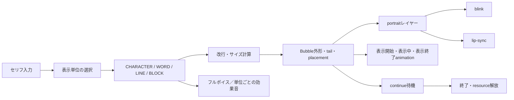
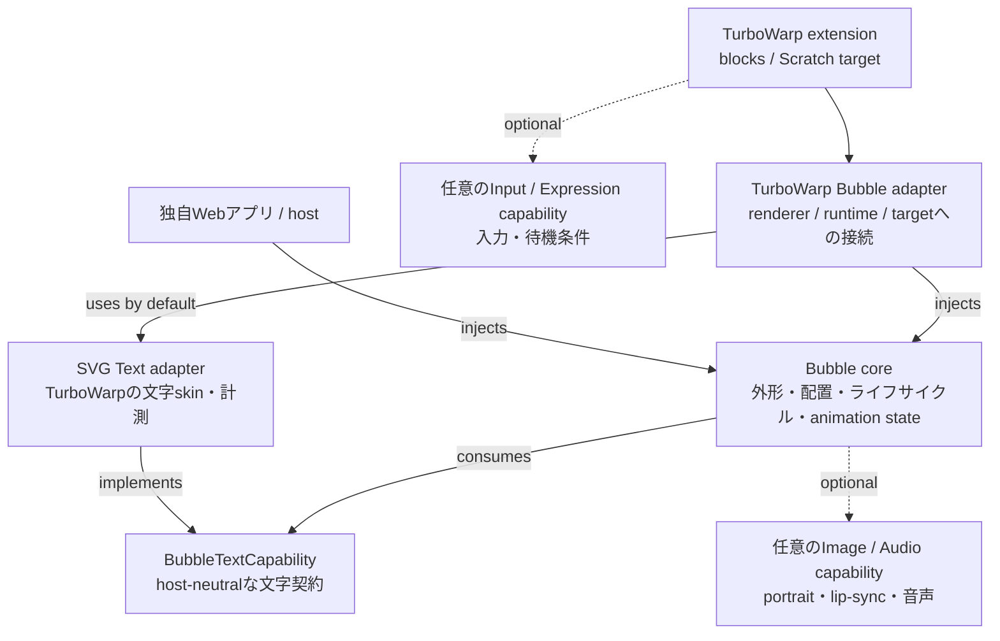
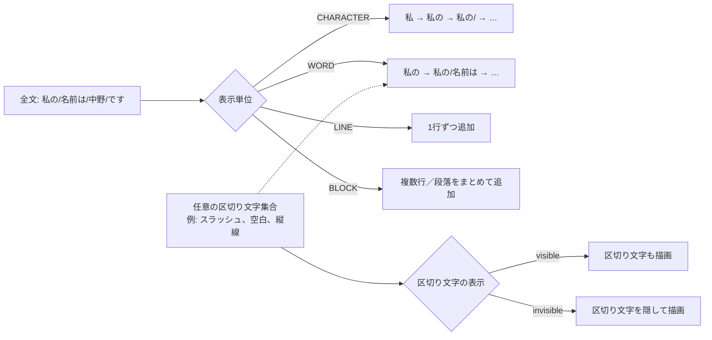
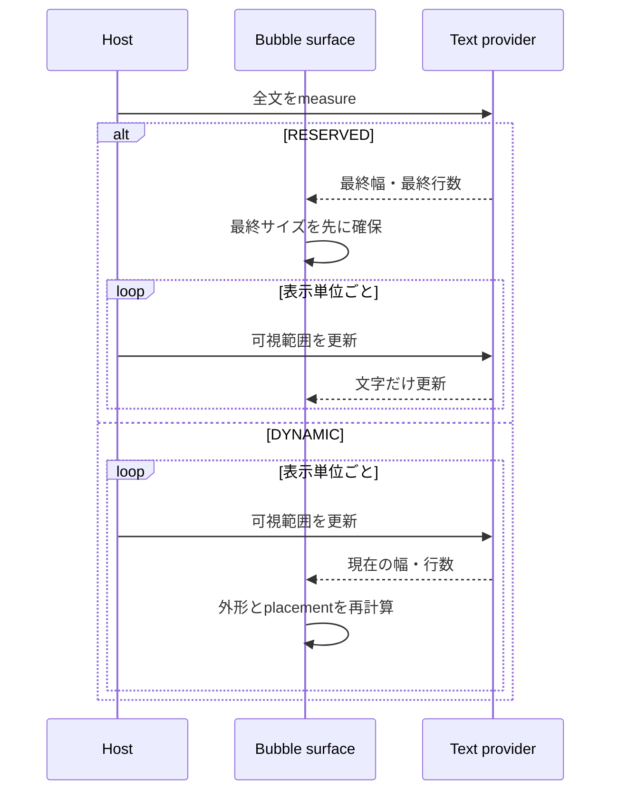
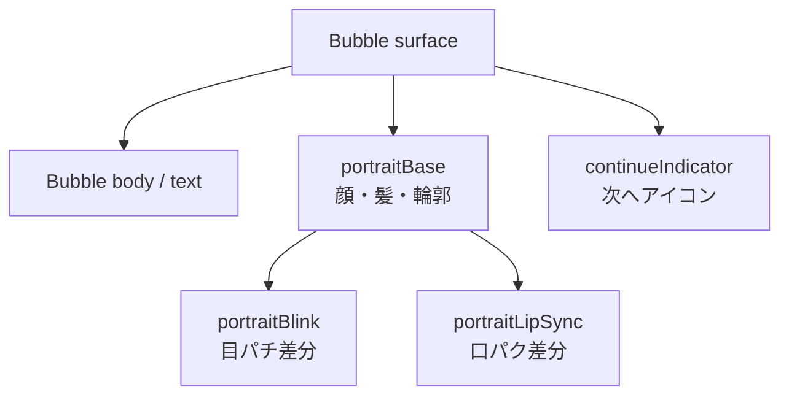
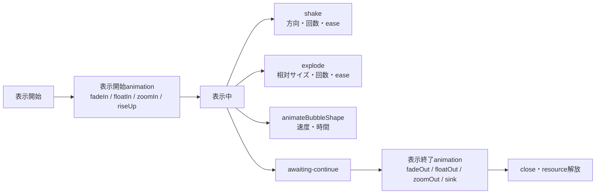

# TurboWarp Bubble

`@kubohiroya/turbowarp-bubble`は、TurboWarp上の`say`／`think`表示を、文字、キャラクター表情、入力待ちアイコンに分けて管理するunsandboxed機能拡張です。同じ機能をアプリから直接利用するためのcomposition APIも提供します。

## READMEの読み方

利用環境を先に決めると、必要な部分だけを読めます。

1. TurboWarpでブロックを使う場合は、後述の[TurboWarp機能拡張](#turbowarp機能拡張)と[提供ブロック](#提供ブロック)を確認します。
2. 独自Webアプリやhostから使う場合は、[Composition API](#composition-api)と[Styleと表示](#styleと表示)を確認します。
3. 表示単位、改行、外形、portrait、animationの仕様を知りたい場合は、[概念と表示仕様](#概念と表示仕様)を参照します。
4. Scratch公式エディターでの利用可否は、[Scratchとの互換性](#scratchとの互換性)に記載しています。

## 機能の全体像

Bubbleは、文字を描くText provider、吹き出しの外形と配置を管理するBubble layer、画像・音声を解決する任意のAsset capabilityを組み合わせます。これにより、TurboWarpの機能拡張としても、アプリのhostから呼び出すcompositionとしても同じ表示モデルを利用できます。



このREADMEでは、現在公開している機能と、3層構成で接続する表示仕様を同じ用語で説明します。公開APIにまだ現れていない仕様は「実装状況」欄で明示しています。

| 領域                                | このREADMEで説明する内容                                                       | 現在の公開API                                                 |
| ----------------------------------- | ------------------------------------------------------------------------------ | ------------------------------------------------------------- |
| 文字描画・改行                      | `BubbleTextCapability`、名前付きstyle、実測幅、`maxWidth`、UAX #14準拠の改行   | 実装済み（TurboWarpではSVG Text adapterを標準接続）           |
| 逐次表示                            | `CHARACTER`／`WORD`／`LINE`／`BLOCK`、区切り文字、単位ごとの効果音、finish条件 | 実装済み（`revealNext`／`revealAll`／`finish`、対応ブロック） |
| portrait                            | ベース画像、`blink`、`lip-sync`の独立レイヤー                                  | 実装済み（Asset Manager capability）                          |
| Bubble外形                          | `NORMAL`等のvisual style、placement、tail、offset、scale                       | 実装済み                                                      |
| 表示mode                            | `talking`／`awaiting-continue`／`idle`                                         | 実装済み                                                      |
| 表示開始・表示中・表示終了animation | `fadeIn`、`floatIn`、`shake`、`animateBubbleShape`等                           | 実装済み（`handle.animate`、style設定、対応ブロック）         |

## 概念と表示仕様

### 3層構成と責務

依存の向きは、純粋なBubble compositionを中心に、TurboWarp adapterと各providerを外側へ置く構成です。矢印は「利用する側」から「利用される側」へ向けています。



この構成では、Bubble coreが`BubbleTextCapability`というホスト非依存の契約だけを参照します。`@kubohiroya/turbowarp-svg-text`は、その契約をTurboWarpのSVG skin・named style・文字幅計測へ接続するadapterです。吹き出しの外枠、tail、portraitの配置、表示開始・表示終了animationは担当しません。TurboWarp adapterはSVG Text adapterを既定値として解決しますが、Composition APIのhostは別の実装を`textCapability`として注入できます。画像解決、音声再生、入力、条件評価もCapabilityとして切り離し、Asset Manager、Async Input、Runtime Expressionは対応機能を使う場合だけ接続します。

### 逐次表示の単位（CHARACTER / WORD / LINE / BLOCK）

セリフ全体を一度に表示するだけでなく、表示対象を「どの単位で一つずつ増やすか」として扱います。`CHARACTER`は形態素解析ではなく、表示上の書記素クラスタ（結合文字や絵文字を途中で分割しない単位）を前提にします。

仕様上の綴りは`CHARACTER`です（`charactor`ではありません）。`BLOCK`は、改行を含む複数行を一つの表示単位として扱う名前で、ここでいうblockはScratchのblockではありません。



### WORDの区切り文字

日本語の形態素解析は行いません。`WORD`は空白で区切る言語、または利用者が区切りを埋め込める言語を対象にします。例えば`私の/名前は/中野/です`を入力し、`/`をWORD delimiterにして不可視にすれば、`私の`→`名前は`→`中野`→`です`の順で表示できます。区切り文字を可視にすれば、スラッシュを演出として残せます。

区切り文字は単一文字に限定せず、任意の文字集合として指定します。delimiter自体を表示単位に含めるか、取り除いてからText providerへ渡すかを選べるようにします。

### DYNAMICとRESERVED

逐次表示中の吹き出しサイズは、次の2方式を選べるようにします。



`RESERVED`は表示中に外形が動きにくく、`DYNAMIC`は短い文では余白を抑えられます。いずれもBubble外形のanimationやportraitレイヤーとは独立したレイアウト方針です。Composition APIではstyleの`reveal`、`handle.revealNext()`、`handle.revealAll()`が分割・タイミングの接続点になり、`intervalSeconds`を指定した自動送りにも対応します。

逐次表示を最後まで進めてから待機へ移る場合は、表示単位を明示したfinish指定を使います。

```text
finish [CHARACTER / WORD / LINE / BLOCK]
  with condition [CONDITION]
  or timeout after [TIMEOUT] seconds
```

`CONDITION`が成立したら未表示の単位を最後まで進め、成立しない場合も`TIMEOUT`秒後に同じ完了処理へ移します。`TIMEOUT`を`0`にすると時間制限を設けません。完了後は`awaiting-continue`へ移すか、hostが`close`または表示終了animationを開始します。Composition APIでは`handle.finish({ unit, condition, timeoutSeconds })`、手続き型拡張では`finish [UNIT] ...`ブロックを使います。

### 音声と表示単位

`finish`は公開Composition APIの`handle.finish({ unit, condition, timeoutSeconds })`と、TurboWarpの`finish [UNIT] ...`ブロックで利用できます。これは逐次表示を最後まで進め、条件成立またはtimeoutで音声と待機状態を確定します。

Asset Managerを音声providerとして接続すると、次の音声を同じ表示ライフサイクルに関連付けられます。

- 表示開始時のフルボイス
- `CHARACTER`／`WORD`／`LINE`／`BLOCK`を一つ進めるごとの効果音
- 表示終了、continue待機、timeoutの通知音

表示単位ごとの効果音は、文字列を音声として合成する機能ではなく、名前付き音声assetを再生する経路です。音声がない場合でも、文字表示・portrait・Bubble外形は独立して利用できます。

### パッケージ境界

| パッケージ                                 | 責務                                                                           |
| ------------------------------------------ | ------------------------------------------------------------------------------ |
| `@kubohiroya/turbowarp-asset-manager`      | 任意のImage／Audio capabilityをTurboWarp assetへ接続（画像解決・音声再生）     |
| Bubble core（`composition`）               | `BubbleTextCapability`契約、吹き出しsurface、配置、逐次表示、animation         |
| `@kubohiroya/turbowarp-svg-text`           | `BubbleTextCapability`をTurboWarpの文字style・SVG skin・計測へ接続するadapter  |
| `@kubohiroya/turbowarp-async-input`        | キー入力・タップをTemporary Variablesのruntime変数へ反映                       |
| `@kubohiroya/turbowarp-runtime-expression` | runtime変数を参照する安全な待機条件の評価                                      |
| `@kubohiroya/turbowarp-bubble`             | 吹き出しsurface、配置、逐次表示、say／think、表情レイヤー、animation、入力待機 |
| アプリ／host                               | 必要に応じたアプリ固有の入力からcomposition APIへの変換                        |

Bubbleは依存パッケージを再exportしません。Composition APIは`textCapability`を必須の契約として受け取り、SVG Textに限定されません。TurboWarp adapterだけが`@kubohiroya/turbowarp-svg-text`を既定のadapterとして解決します。画像・音声・入力・条件評価はCapabilityとして差し替えられ、TurboWarp adapterではAsset Managerを遅延接続し、Composition APIでは`imageResolver`／`audio`をhostが任意に実装できます。Asset Managerを使う機能は画像だけでなく、フルボイス、タイプライター音、行・段落ごとの効果音などの外部メディアも対象にします。

### 自動改行と禁則処理の基盤

Bubbleの任意`maxWidth`による自動改行では、`@cto.af/linebreak`を利用してUnicode UAX #14準拠の改行可能位置を求めます。依存は`LineBreakProvider` interfaceの内側へ閉じ込め、実際のフォントで測った幅から、上限内に収まる最も後ろの候補をBubble側で選びます。

`UnicodeLineBreakProvider`はUAX #14の候補を`Intl.Segmenter`の書記素境界で絞るため、句読点や小書き仮名の禁則に加え、結合文字や絵文字の途中分割も避けます。明示改行は維持し、URLなど分割可能な候補がない文字列だけを書記素境界でfallback分割します。

```ts
import { wrapText } from "@kubohiroya/turbowarp-bubble/composition";

const layout = wrapText({
  text: "これは長いセリフです。",
  maxWidth: 320,
  measureText: (text) => textRenderer.measure(text),
});
```

Composition APIのBubble styleへ`maxWidth`と任意の`textLocale`を渡すと、Text capabilityの`measureText`を使ってこの`wrapText`基盤が実際の表示文字列を自動改行します。SVG Textまたはhost側のText capabilityが`measureText`を提供しない場合、`maxWidth`を使った表示は明示的なcapabilityエラーになります。


図の各行はproductionの`wrapText`を直接呼んだ結果です。図版専用の手作業改行は使っていません。

### Bubble visual styleの形状

形状候補は`NORMAL`、`THINKING`、`DREAMING`、`YELLING`、`OFF_PANEL`、`WAVY`、`WHISPERING`、`ANNOUNCEMENT`、`NARRATION`、`NO_BUBBLE`です。


この図はBubble側の共有`renderBubbleSvg`から生成しています。三角形tailを持つ形状は、tail基部の2点を実際の本体border上から求め、[platener/jsclipper](https://github.com/platener/jsclipper)で本体polygonとtail三角形の和集合を作り、単一の外周pathだけを描画します。`THINKING`／`DREAMING`の丸trailは独立形状のままです。

standalone機能拡張では、`set bubble visual style`ブロックで形状を選択できます。runtimeは共有`renderBubbleSvg`から本体用SVG skinを生成し、文字・表情より背面の専用drawableへ適用します。Actor相対ではActorを向くtailを生成し、背景相対ではtailを付けません。`NO_BUBBLE`では本体を非表示にして文字・表情などだけを表示します。`NEGATIVE`はfill colorとborder colorで表現できるため独立styleにせず、orientationとsegmentsも公開入力にしません。

配布bundleに含まれる依存ライブラリのライセンスは、[THIRD_PARTY_NOTICES.md](THIRD_PARTY_NOTICES.md)を参照してください。

## 利用方法

### インストール

```sh
pnpm add @kubohiroya/turbowarp-bubble
```

npmを使う場合は同じ依存を次のように追加します。

```sh
npm install @kubohiroya/turbowarp-bubble
```

逐次表示の正規化と文字列分割だけが必要な利用側は、Bubble composition全体を含めずに小さな`reveal` entryをimportできます。

```ts
import {
  normalizeBubbleReveal,
  splitBubbleText,
} from "@kubohiroya/turbowarp-bubble/reveal";

const reveal = normalizeBubbleReveal({ unit: "CHARACTER" });
const chunks = splitBubbleText("A👩‍🚀B", reveal);
```

現在のpeer dependency範囲は、SVG Textが`>=0.4.0 <1`、Asset Managerが`>=0.7.0 <1`、Async InputとRuntime Expressionがそれぞれ`>=0.3.0 <1`です。4つすべてoptional peer dependencyで、SVG TextはTurboWarp adapterの既定adapterを使う場合だけ必要です。別の`textCapability`を注入するhostはSVG Textをインストールする必要がありません。

TurboWarp adapterの既定文字経路を使う場合は、SVG Textを追加します。

```sh
pnpm add @kubohiroya/turbowarp-svg-text
```

画像portrait、lip-sync、continue indicator、または音声アセットを使う機能を利用する場合はAsset Managerを追加します。`CONDITION`付きの待機ブロックを使う場合はAsync InputとRuntime Expressionを追加します。

```sh
pnpm add @kubohiroya/turbowarp-asset-manager \
  @kubohiroya/turbowarp-async-input \
  @kubohiroya/turbowarp-runtime-expression
```

```sh
npm install @kubohiroya/turbowarp-asset-manager \
  @kubohiroya/turbowarp-async-input \
  @kubohiroya/turbowarp-runtime-expression
```

### TurboWarp機能拡張

ブロックの組み方、表情差分の準備、入力待ち、clone、エラー対処を含む手順は、ブロック利用マニュアル（[English](https://kubohiroya.github.io/turbowarp-bubble/) / [日本語](https://kubohiroya.github.io/turbowarp-bubble/ja/)）を参照してください。`talking`から`awaiting-continue`、入力成立、`close`までのアニメーション例も掲載しています。

#### TurboWarpでの導入

TurboWarp Bubbleの`dist/turbowarp-bubble.js`は、TurboWarpのrendererとtarget APIへ接続する**unsandboxedカスタム拡張機能**です。TurboWarp Editorでは、次の順で読み込みます。

1. TurboWarp Editorでプロジェクトを開き、拡張機能の追加からTemporary Variablesを追加します。
2. 「カスタム拡張機能」を選び、サンドボックスなし（Run without sandbox）で実行できる状態にします。
3. SVG Textを読み込みます。Bubbleの文字style定義と文字幅計測に必要です。
4. portrait、blink、lip-sync、continue frames、音声を使う場合はAsset Managerを読み込みます。
5. `wait with this bubble until condition ...`を使う場合はAsync InputとRuntime Expressionを読み込みます。
6. 最後にBubbleを読み込みます。依存拡張を先に読み込むと、対応するブロックとcapabilityが接続されます。

最小構成はTemporary Variables、SVG Text、Bubbleです。Asset Manager、Async Input、Runtime Expressionは、対応する機能を使わなければ追加しなくても構いません。拡張機能を読み込んだ後、`define text style`、`define bubble style`、`say`または`think`の順でブロックを配置します。

```text
# SVG Text（必須）
https://unpkg.com/@kubohiroya/turbowarp-svg-text@0.4.0/dist/svg-text.js

# portrait／blink／lip-sync／continue／音声を使う場合だけ追加
https://unpkg.com/@kubohiroya/turbowarp-asset-manager@0.7.0/dist/asset-manager.js

# 条件待ちを使う場合だけ追加
https://unpkg.com/@kubohiroya/turbowarp-async-input@0.3.0/dist/async-input.js
https://unpkg.com/@kubohiroya/turbowarp-runtime-expression@0.3.0/dist/runtime-expression.js

# Bubble（必ず最後）
https://unpkg.com/@kubohiroya/turbowarp-bubble@0.6.0/dist/turbowarp-bubble.js
```

TurboWarpのカスタム拡張機能はURLからJavaScriptを読み込むため、初回読み込み時にネットワーク接続が必要です。開発中は、リポジトリをローカルHTTPサーバーで配信して`dist/turbowarp-bubble.js`を指定できます。`file://`で直接開いたファイルや、サンドボックス付きの拡張機能としては動作しません。

#### Scratchとの互換性

Scratch公式エディター（Scratch 3.0）から、TurboWarp Bubbleをカスタム拡張機能として直接利用することはできません。Scratch公式にはTurboWarpのunsandboxed拡張機能、renderer内部API、target drawable APIがないためです。Scratch向けの.sb3プロジェクトへこのREADMEのURLを追加しても、Bubbleのブロックは登録されません。

利用環境ごとの位置付けは次のとおりです。

| 環境                            | 利用方法                                                              | 対応                         |
| ------------------------------- | --------------------------------------------------------------------- | ---------------------------- |
| TurboWarp Editor                | `dist/turbowarp-bubble.js`をunsandboxedカスタム拡張機能として読み込む | 対応                         |
| TurboWarp Packager／互換runtime | unsandboxedカスタム拡張機能とrenderer APIが利用できる構成で読み込む   | 対応（環境ごとに確認が必要） |
| Scratch公式エディター           | 公式拡張機能またはサンドボックス拡張機能として読み込む                | 非対応                       |
| 独自Webアプリ／ホスト           | npmのcomposition APIまたはTurboWarp adapterをJavaScriptから利用する   | 対応                         |

Scratch互換の別runtimeで利用するには、そのruntimeがTurboWarpと同じunsandboxed APIとrenderer契約を実装している必要があります。独自Webアプリでは、TurboWarp用のブロック拡張機能ではなく、`@kubohiroya/turbowarp-bubble/composition`または`@kubohiroya/turbowarp-bubble/turbowarp-adapter`を利用してください。

Bubbleは呼び出し元のsprite、clone、またはStageごとに表示を所有します。SVG本体、文字、表情ベース、目パチ、口パク、次へアイコンのrenderer drawableは自動生成されるため、レイヤー用spriteをプロジェクトへ追加する必要はありません。Stageから表示できるのは背景相対placementを使うstyleだけです。

#### 提供ブロック

| ブロック                                                                               | 動作                                                              |
| -------------------------------------------------------------------------------------- | ----------------------------------------------------------------- |
| `define bubble style [STYLE] using text style [TEXT_STYLE]`                            | Bubble styleを定義し、SVG Textで定義した文字style名を関連付ける   |
| `set bubble placement [PLACEMENT] for bubble style [STYLE]`                            | Actor相対方向・角度、または背景相対領域を設定する                 |
| `set bubble distance [DISTANCE] for bubble style [STYLE]`                              | Actor boundsからtail先端までの距離を設定する                      |
| `set bubble visual style [VISUAL_STYLE] for bubble style [STYLE]`                      | Bubble本体のSVG形状を10種類から設定する                           |
| `set bubble tail length [LENGTH] for bubble style [STYLE]`                             | Bubble borderからtail先端までの基準長を設定する                   |
| `set bubble offset x [X] y [Y] scale [SCALE] % for bubble style [STYLE]`               | 本体位置と、文字を含むBubble全体の拡大率を設定する                |
| `set portrait base [ASSET] for bubble style [STYLE]`                                   | 表情ベース画像を設定する。空文字でportrait全体を解除する          |
| `set blink frames [ASSETS] every [SECONDS] seconds for bubble style [STYLE]`           | 目パチ差分を設定する。空リストで解除する                          |
| `set lip-sync frames [ASSETS] every [SECONDS] seconds for bubble style [STYLE]`        | 口パク差分を設定する。空リストで解除する                          |
| `set continue frames [ASSETS] every [SECONDS] seconds for bubble style [STYLE]`        | 入力待ちアイコンを設定する。2フレーム以上必要。空リストで解除する |
| `say [MESSAGE] with bubble style [STYLE]`                                              | `talking` modeでsay表示を開始または置換する                       |
| `think [MESSAGE] with bubble style [STYLE]`                                            | `talking` modeでthink表示を開始または置換する                     |
| `set this bubble animation mode [MODE]`                                                | `talking`／`awaiting-continue`／`idle`を切り替える                |
| `wait with this bubble until condition [CONDITION] or timeout after [TIMEOUT] seconds` | 条件成立またはtimeoutまでBubbleを表示したまま待つ                 |
| `close this bubble`                                                                    | 呼び出し元のBubbleと所有resourceを解放する                        |
| `Bubble version`                                                                       | 実装versionを返す                                                 |

`ASSETS`はAsset Managerへ登録済みの画像アセット名をカンマ区切りで指定します。アセット名自体にカンマは使用できません。すべての`SECONDS`は0より大きい秒数です。

visual styleを設定しない場合は`NORMAL`です。本体drawableは文字・表情より背面に生成され、close、対象停止、runtime破棄時にSVG skinとともに解放されます。

#### Placement

`PLACEMENT`はActor相対と背景相対の二系統です。省略時は`up-right`です。

- Actor相対：16の正規方向名、そのcompass alias、またはScratch方向と同じ0〜360度。`0`は上、`90`は右、`180`は下、`270`は左で、`360`は`0`へ正規化します。任意角度は16方向へ丸めません。
- 背景相対：`HEADER_LIKE`、`CENTER`、`FOOTER_LIKE`。Stage安全領域の上部、中央、下部へ水平中央揃えで置き、Actor位置・bounds・可視性には依存しません。

Actor相対の正規方向名は次の16個です。別名は大文字小文字を区別せず、正規名へ変換されます。

| 正規名             | compass alias     | 正規名           | compass alias     |
| ------------------ | ----------------- | ---------------- | ----------------- |
| `up`               | `north`           | `down`           | `south`           |
| `up-up-right`      | `north-northeast` | `down-down-left` | `south-southwest` |
| `up-right`         | `northeast`       | `down-left`      | `southwest`       |
| `right-up-right`   | `east-northeast`  | `left-down-left` | `west-southwest`  |
| `right`            | `east`            | `left`           | `west`            |
| `right-down-right` | `east-southeast`  | `left-up-left`   | `west-northwest`  |
| `down-right`       | `southeast`       | `up-left`        | `northwest`       |
| `down-down-right`  | `south-southeast` | `up-up-left`     | `north-northwest` |


図中の16方向は、それぞれActor、実際のBubble外形、tail、文字を含む表示例です。本体とtailはJSClipperのunionによる単一pathなので、接合部に内部border線はありません。背景相対3図はStage外枠、安全領域、外形寸法、水平中央線、基準辺／中心を示します。図とTurboWarp Editorの本体drawableは、どちらも共有`renderBubbleSvg`から生成します。


Actor相対の`distance`はActorのStage座標AABB（axis-aligned bounding box。rendererの`getBoundsForBubble()`が返す上下左右）からtail先端までで、既定値は`12`です。`tail length`は通常位置における本体borderからtail先端までで、既定値は`18`です。

`offset x/y/scale`の既定値は`[0, 0, 100]`です。xは右、yは上が正です。scaleはBubble外形だけでなく、SVG Textの文字（フォントサイズ）、表情画像、次へアイコン、内部余白へ一体で適用します。scaleだけを変えた場合は、拡大量の半径分だけ本体中心をActorから離し、Actor側の間隔を維持します。その後x/y offsetを加え、固定したtail先端へ向けてtailを再生成するため、offset後の実長は`tail length`から変化し得ます。Stage端では全体が画面内に収まるようクランプします。これら3設定は背景相対placementでは無視します。

#### Portraitとblink / lip-sync

portraitは、位置合わせ済みの透明画像を重ねるレイヤーです。ベース画像と差分画像を同じcanvasサイズ・中心位置で用意すると、顔を描き直さずに目と口だけを更新できます。



| レイヤー            | 表示中の動作                                           | 設定ブロック／API                           |
| ------------------- | ------------------------------------------------------ | ------------------------------------------- |
| `portraitBase`      | 常時表示するベース画像                                 | `set portrait base` / `portrait.base`       |
| `portraitBlink`     | `talking`、`awaiting-continue`、`idle`のすべてでループ | `set blink frames` / `portrait.blink`       |
| `portraitLipSync`   | `talking`中だけループし、待機時は停止・非表示          | `set lip-sync frames` / `portrait.lipSync`  |
| `continueIndicator` | `awaiting-continue`中だけループ                        | `set continue frames` / `continueIndicator` |

目パチと口パクは1枚の静止画でも利用できます。口パクのキーワードは、話す行為全体ではなく口元の表情差分を指定する意味で`lip-sync`に統一しています。`continue`は、入力待ちを表すアイコンのanimationであり、JavaScriptの`continue`文を実行する機能ではありません。


#### Bubble animation

Bubbleのanimationは、画像フレームのループ（blink、lip-sync、continue）と、Bubble surface自体の変形を分けて考えます。現在公開している`set this bubble animation mode`は前者の動作modeを切り替えます。後者は、同じsurfaceへ適用する汎用animation仕様として整理します。



##### 表示開始と表示終了

PowerPointの用語を参考にしつつ、Bubbleの仕様名は「表示開始animation」「表示終了animation」とします。表示開始には`fadeIn`、`floatIn`、`zoomIn`、`riseUp`、表示終了には`fadeOut`、`floatOut`、`zoomOut`、`sink`を使います。表示開始・表示終了animationは`RESERVED`だけに限定しません。`DYNAMIC`で表示サイズを更新しているBubbleにも適用でき、表示終了時には現在の外形を基準に終点を計算します。

##### 表示中の変形

- `shake + direction + count + ease`: 吹き出し全体を指定方向へ揺らします。`direction`は水平・垂直・斜めを指定でき、`count`は往復回数、`ease`は各往復の速度曲線です。
- `explode + relativeScale + count + ease`: 現在サイズを基準に拡大・縮小を繰り返します。portraitとTextを含むsurface全体へ同じ相対変化を適用します。
- `animateBubbleShape + speed + duration`: `THINKING`、`DREAMING`、`YELLING`、`WAVY`、`WHISPERING`などの外形を指定速度・時間で切り替えます。`visualStyle`の切替と、表示中のsurface animationを分離できます。

TurboWarp adapterは16ms単位のscheduler tickで各animationを進め、`ease`を各フレームの進行率へ適用します。`fadeIn`／`fadeOut`はrendererの`ghost`効果、`float`／`rise`／`sink`は位置、`zoom`／`explode`は倍率をText・portrait・Bubble本体へ同じように適用します。`shake`は指定回数の往復を行い、`explode`は拡大と復帰を繰り返します。`durationSeconds`を省略した`shake`／`explode`には、回数に応じた既定時間を使います。

`animateBubbleShape`は、現在形状と指定形状を各フレームでcross-fadeするSVG body skinへ更新します。Textとportraitは再生成せず、外形だけを連続的に切り替えます。`speed`は指定時間内の形状遷移速度倍率です。

animationは`show`、`handle.animate()`、`handle.setAnimationMode()`、`handle.updateStyle()`、`handle.close()`のライフサイクルに接続します。新しいBubbleで同じ`actorKey`を置き換えると、旧animationのtimerとdrawableを先に解放します。`shake`には`ease`を指定でき、`explode`には`relativeScale`、`count`、`ease`、`animateBubbleShape`には`speed`と`durationSeconds`を指定できます。

#### Animation mode

| mode                | 目パチ | 口パク       | continue frames |
| ------------------- | ------ | ------------ | --------------- |
| `talking`           | 実行   | 実行         | 非表示          |
| `awaiting-continue` | 実行   | 停止・非表示 | ループ実行      |
| `idle`              | 実行   | 停止・非表示 | 停止・非表示    |

`say`／`think`ブロックは`talking`で表示を開始し、すぐ次のブロックへ進みます。`wait with this bubble ...`は自動的に`awaiting-continue`へ移り、Async Inputが更新するruntime変数をRuntime Expressionで評価します。条件成立またはtimeout後は`idle`へ移って次のブロックへ進みます。

#### ブロック構成例

```text
define bubble style [hero-dialogue] using text style [dialogue-text]
set bubble placement [up-right] for bubble style [hero-dialogue]
set bubble distance [12] for bubble style [hero-dialogue]
set bubble visual style [NORMAL] for bubble style [hero-dialogue]
set bubble tail length [18] for bubble style [hero-dialogue]
set bubble offset x [10] y [-10] scale [120] % for bubble style [hero-dialogue]
set portrait base [HeroFace] for bubble style [hero-dialogue]
set blink frames [HeroEyesOpen,HeroEyesClosed] every [0.4] seconds for bubble style [hero-dialogue]
set lip-sync frames [HeroMouthClosed,HeroMouthOpen] every [0.1] seconds for bubble style [hero-dialogue]
set continue frames [Next1,Next2] every [0.2] seconds for bubble style [hero-dialogue]
set runtime variable [input] to []
listen for key [Space] set runtime var [input] to [pressed]
listen for touch on this sprite set runtime var [input] to [pressed]
say [海へ出発！] with bubble style [hero-dialogue]
wait with this bubble until condition [input == "pressed"] or timeout after [10] seconds
close this bubble
```

プロジェクト開始・停止、対象sprite／cloneの停止、runtime破棄でも、所有するtimer、SVG text skin、drawableを自動解放します。依存拡張が未ロードの場合は、必要なnpmパッケージ名を含むerrorを返します。

### Composition API

TurboWarp runtimeのrenderer、SVG Textへ直接接続するhostでは、公開adapterを利用できます。画像portrait、lip-sync、continue indicator、または音声アセットを使う場合だけ、Asset Managerを追加でロードしてください。

```ts
import { createTurboWarpBubbleComposition } from "@kubohiroya/turbowarp-bubble/turbowarp-adapter";

const bubbles = createTurboWarpBubbleComposition(runtime);
```

描画surfaceをhost側で実装する場合は、以下の低レベルComposition APIを利用します。

```ts
import {
  createBubbleComposition,
  type BubbleImageCapability,
  type BubbleSurfaceFactory,
  type BubbleTextCapability,
} from "@kubohiroya/turbowarp-bubble/composition";

// These are host-owned capabilities. They may be backed by Asset Manager,
// another asset service, or local application code.
declare const imageResolver: BubbleImageCapability;
declare const textCapability: BubbleTextCapability;
declare const bubbleSurfaceHost: BubbleSurfaceFactory;

const bubbles = createBubbleComposition({
  imageResolver,
  textCapability,
  createSurface: bubbleSurfaceHost,
});
```

`declare`部分はサンプルを短くするための型宣言です。実際のhostでは、`BubbleTextCapability`（文字skinの適用・計測・解放）、`BubbleImageCapability`（画像名の解決）、`BubbleAudioCapability`（音声再生）、`BubbleSurfaceFactory`（外枠・text・portrait各targetの生成）を実装して渡します。`@kubohiroya/turbowarp-svg-text/composition`を使う場合は、`createSvgTextCompositionCapability(createSvgTextComposition({ runtime }))`で`textCapability`へ変換します。TurboWarp runtimeを使う場合は、これらを個別に実装せず`createTurboWarpBubbleComposition(runtime)`を使えます。

テキストだけを表示する場合は、Asset Managerのimport、`createAssetManagerComposition()`、`imageResolver`プロパティをすべて省略できます。Asset Managerは画像だけでなく、フルボイス、タイプライター音、行・段落ごとの効果音を登録・再生するためのメディア経路として利用します。音声付きBubble APIは表示機能と同じ名前付きアセットを使う設計にします。

`createSurface`が返すsurfaceは、次のtargetを持ちます。

surfaceは`updateStyle(style)`も実装し、吹き出しの位置・形状・サイズを更新できるようにします。表示中のBubbleのstyleを変更する場合は、返されたhandleの`updateStyle(style)`を呼び出します。更新後のstyleで画像レイヤーを使う場合、surfaceが対応するtargetをあらかじめ返している必要があります。

- `text`: `textCapability`が文字スキンを適用するtarget
- `portraitBase`: キャラクター表情のベース画像target
- `portraitBlink`: 目パチ差分target
- `portraitLipSync`: 口パク差分target
- `continueIndicator`: 「次へ」アイコンtarget

画像レイヤーのtarget IDは互いに異なる必要があります。styleで使わないレイヤーのtargetは省略できます。

#### Styleと表示

```ts
bubbles.defineStyle({
  name: "hero-dialogue",
  textStyle: "dialogue-text",
  placement: "north-northeast",
  distance: 12,
  visualStyle: "NORMAL",
  tailLength: 18,
  offset: [10, -10, 120],
  portrait: {
    base: "HeroFace",
    blink: {
      frames: ["HeroEyesOpen", "HeroEyesClosed"],
      frameIntervalSeconds: 0.4,
    },
    lipSync: {
      frames: ["HeroMouthClosed", "HeroMouthOpen"],
      frameIntervalSeconds: 0.1,
    },
  },
  continueIndicator: {
    frames: ["Next1", "Next2"],
    frameIntervalSeconds: 0.2,
  },
  reveal: {
    unit: "CHARACTER",
    layout: "RESERVED",
    intervalSeconds: 0.05,
    sound: "Typewriter",
  },
  audio: {
    voice: "HeroVoice",
    reveal: "Typewriter",
  },
  showAnimation: { name: "fadeIn", durationSeconds: 0.2 },
  hideAnimation: { name: "fadeOut", durationSeconds: 0.2 },
});

bubbles.defineStyle({
  name: "narration",
  textStyle: "dialogue-text",
  placement: "FOOTER_LIKE",
  maxWidth: 320,
  textLocale: "ja",
});

const bubble = await bubbles.show({
  actor: heroTarget,
  actorKey: "Hero",
  kind: "say",
  text: "海へ出発！",
  styleName: "hero-dialogue",
});
```

`show`の初期animation modeは`talking`です。目パチは表示中継続し、口パクが動きます。全文表示後にアプリが「次へ」操作待ちへ移るとき、modeを`awaiting-continue`へ変更します。

```ts
await bubble.setAnimationMode("awaiting-continue");
// 口パクを停止して非表示にし、「次へ」アイコンをループ表示します。

await bubble.setAnimationMode("idle");
// 吹き出しを残したまま、口パクと「次へ」アイコンを停止します。

await bubble.revealNext();
await bubble.revealAll();
await bubble.animate({
  name: "shake",
  direction: 90,
  count: 2,
  ease: "easeInOut",
});
await bubble.finish({
  unit: "CHARACTER",
  condition: () => inputState === "pressed",
  timeoutSeconds: 10,
});

await bubble.close();
```

返されたhandleの`setText(text)`は同じsurface上の本文を更新し、文字送りなどに利用できます。`handle.updateStyle(style)`は表示中のBubbleへstyle変更を即時適用します。同じ`actorKey`へ新しいBubbleを表示すると、以前のBubbleを完全に破棄してから置き換えます。`releaseTarget`、`releaseAll`、`dispose`も、所有するtimer、text capability target、surfaceを解放します。composition間で状態は共有しません。

## ライセンスとソースコード

このパッケージのSource Code Formは[MPL-2.0](https://www.mozilla.org/MPL/2.0/)の条件で提供します。対応するソースコードは[GitHubリポジトリ](https://github.com/kubohiroya/turbowarp-bubble)から取得できます。npmおよびCDNで配布するJavaScript bundleに対応するソースコードも、このリポジトリの同じpackage versionから参照できます。

配布物に組み込まれる第三者ソフトウェアの著作権表示とライセンス条件は、[THIRD_PARTY_NOTICES.md](THIRD_PARTY_NOTICES.md)にまとめています。

## 開発

```sh
pnpm install
pnpm check
```

`pnpm check`は型検査、lint、format、単体テスト、配布物検査、外部consumer型検査、npm pack dry-runを実行します。
