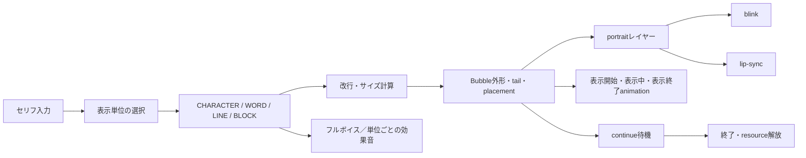
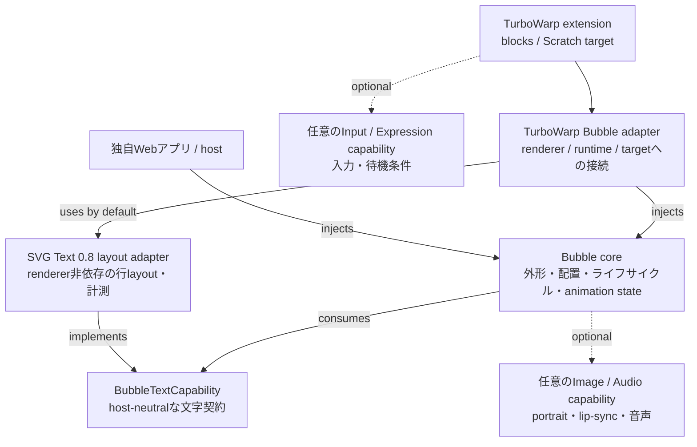
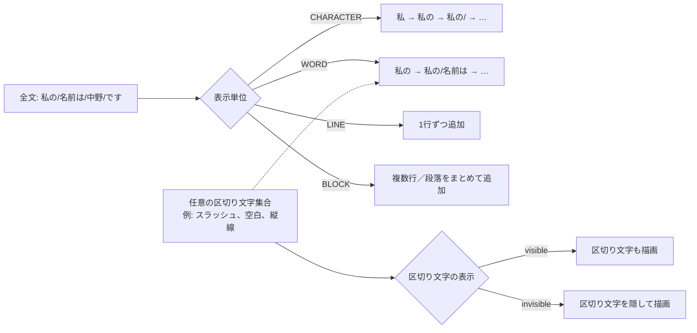
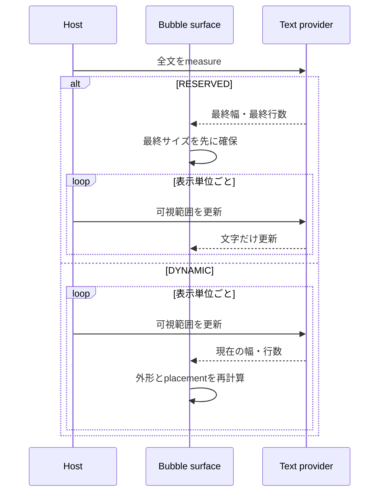
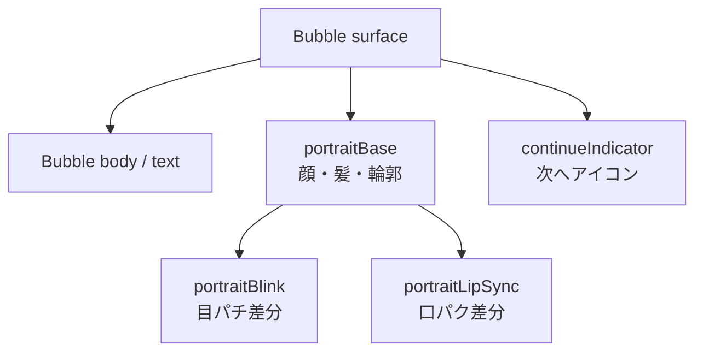
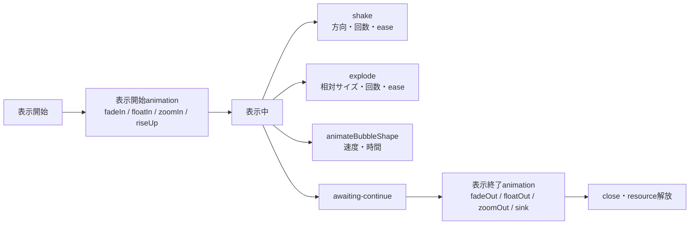

# TurboWarp Bubble

[English](README.md) | **日本語**

`@kubohiroya/turbowarp-bubble`は、TurboWarp上の`say`／`think`表示を、文字、キャラクター表情、入力待ちアイコンに分けて管理するunsandboxed機能拡張です。同じ機能をアプリから直接利用するためのcomposition APIも提供します。

現在のリリースはBubble 0.8.0です。既定の描画経路はSVG Text 0.8.1を使うskin非依存のSVG overlayです。TurboWarpですべての機能を使う場合、現在の推奨組み合わせはAsset Manager 0.12.1、Async Input 0.4.0、Runtime Expression 0.4.0です。

## READMEの読み方

利用環境を先に決めると、必要な部分だけを読めます。

1. TurboWarpでブロックを使う場合は、後述の[TurboWarp機能拡張](#turbowarp機能拡張)と[提供ブロック](#提供ブロック)を確認します。
2. 独自Webアプリやhostから使う場合は、[Composition API](#composition-api)と[Styleと表示](#styleと表示)を確認します。
3. 表示単位、改行、外形、portrait、animationの仕様を知りたい場合は、[概念と表示仕様](#概念と表示仕様)を参照します。
4. Scratch公式エディターでの利用可否は、[Scratchとの互換性](#scratchとの互換性)に記載しています。

## 機能の全体像

Bubbleは、文字を描くText provider、吹き出しの外形と配置を管理するBubble layer、画像・音声を解決する任意のAsset capabilityを組み合わせます。これにより、TurboWarpの機能拡張としても、アプリのhostから呼び出すcompositionとしても同じ表示モデルを利用できます。



次の表は0.8.0の機能と公開entry pointの対応です。standalone機能拡張は`src/block-definitions.json`から生成した28ブロックを公開しており、全一覧は[提供ブロック](#提供ブロック)に掲載しています。

| 領域                                | このREADMEで説明する内容                                                       | 公開entry point                                        |
| ----------------------------------- | ------------------------------------------------------------------------------ | ------------------------------------------------------ |
| 文字描画・改行                      | `BubbleTextCapability`、名前付きstyle、実測幅、`maxWidth`、UAX #14準拠の改行   | `composition`、`turbowarp-adapter`、機能拡張ブロック   |
| 逐次表示                            | `CHARACTER`／`WORD`／`LINE`／`BLOCK`、区切り文字、単位ごとの効果音、finish条件 | `composition`、軽量な`reveal` entry、機能拡張ブロック  |
| portrait                            | ベース画像、`blink`、`lip-sync`の独立レイヤー                                  | Asset Managerを介したComposition APIと機能拡張ブロック |
| Bubble外形                          | `NORMAL`等のvisual style、placement、tail、offset、scale                       | Composition API、TurboWarp adapter、機能拡張ブロック   |
| 表示mode                            | `talking`／`awaiting-continue`／`idle`                                         | `BubbleHandle.setAnimationMode()`と対応ブロック        |
| 表示開始・表示中・表示終了animation | `fadeIn`、`floatIn`、`shake`、`animateBubbleShape`等                           | style設定、`BubbleHandle.animate()`、機能拡張ブロック  |

## 概念と表示仕様

### 3層構成と責務

依存の向きは、純粋なBubble compositionを中心に、TurboWarp adapterと各providerを外側へ置く構成です。矢印は「利用する側」から「利用される側」へ向けています。



この構成では、Bubble coreが`BubbleTextCapability`というホスト非依存の契約だけを参照します。TurboWarp adapterの既定経路は直接依存する`@kubohiroya/turbowarp-svg-text@0.8.1`の`createSvgTextLayoutComposition().layoutText()`を使い、SVG skinを生成せず行layoutと文字幅を得ます。standalone SVG Text 0.8.1が既にロードされている場合は、その公開`getLayoutCapability()`を利用し、project blockで定義済みのfont、色、size、alignmentを維持します。吹き出しの外枠、tail、portraitの配置、表示開始・表示終了animationはSVG Textの責務に含めません。Composition APIのhostは別の実装を`textCapability`として注入できます。画像解決、音声再生、入力、条件評価もCapabilityとして切り離し、Asset Manager、Async Input、Runtime Expressionは対応機能を使う場合だけ接続します。

### 描画backend（SVG overlayが既定）

`bubbleRenderBackend`を省略した場合の既定値は`"svg-overlay"`です。`renderer.addOverlay(root, "scale")`でstage canvas上に共有SVG rootを置き、body、tail、text、portrait、corner clip、continue indicatorをDOM要素として描画します。文字にはstandalone拡張の共有named-style registry、またはBubble内包compositionから得るSVG Text 0.8.1のhost-neutral layoutを使います。この既定経路ではBubbleの表示、text更新、style更新、animationのために`createDrawable()`、`createSVGSkin()`、`createBitmapSkin()`を呼ばず、Bubble由来の処理はscratch-renderの`SVGSkin`／`Silhouette`経路へ入りません。`"scratch-render"`は互換性とロールバックのため明示指定時だけ使用します。

TurboWarpでstock Asset Manager 0.12.1をBubbleより先に読み込むと、Bubbleはportrait等を初めて使う時に`runtime.ext_kubohiroyaassetmanager.getDOMImageCapability()`を呼び、Asset Managerブロックで登録された同じregistryへ遅延接続します。文字だけを使う場合はAsset Managerを読み込みません。Composition APIのhostは、次のようにcapabilityを明示注入できます。

```ts
import { createAssetManagerComposition } from "@kubohiroya/turbowarp-asset-manager/composition";
import { createSvgTextLayoutComposition } from "@kubohiroya/turbowarp-svg-text/composition";
import {
  createAssetManagerSvgOverlayImageCapability,
  createSvgTextOverlayTextCapability,
  createTurboWarpBubbleComposition,
} from "@kubohiroya/turbowarp-bubble/turbowarp-adapter";

const assets = createAssetManagerComposition();
const textLayouts = createSvgTextLayoutComposition();

textLayouts.defineStyle({
  name: "dialogue-text",
  alignment: "left",
  backgroundColor: "transparent",
  font: "Helvetica",
  fontPercent: 100,
  textColor: "#575e75",
});

const bubbles = createTurboWarpBubbleComposition(runtime, {
  svgOverlayTextCapability: createSvgTextOverlayTextCapability(textLayouts),
  svgOverlayImageCapability:
    createAssetManagerSvgOverlayImageCapability(assets),
});
```

`svgOverlayTextCapability`を省略し、standalone SVG Text 0.8.1がロード済みの場合、Bubbleはfrozenな`getLayoutCapability()`を取得し、SVG Text blockが更新する同じnamed-style registryを解決します。standaloneがない場合だけ、BubbleはSVG Text 0.8.1のlayout compositionを生成し、`default`および初めて参照されたtext-style名を背景透明の既定styleで初期化します。公開handoffがない古いstandaloneが存在する場合はproject styleを黙って置換せず`BUBBLE-RUNTIME-004`を返し、`svgOverlayUnsupportedBehavior: "fallback"`を明示した場合だけscratch-renderへ戻ります。capabilityを明示注入すると両方の自動経路を置換できます。portrait等を使う場合、Bubble所有の`createAssetManagerSvgOverlayImageCapability()`がAsset Managerの汎用DOM resourceをBubbleの画像契約へ変換します。依存方向はBubbleからAsset Managerへの一方向であり、Asset ManagerはBubbleの型やsecurity markerを参照しません。adapterは両者が許可するMIME typeだけを公開し、検証済みMIME type、intrinsic size、`blob:` URL、`release()`を引き継ぎ、Asset ManagerがsanitizeしたSVGへBubble側のmetadataを付与します。Bubbleは任意SVG文字列を挿入せず、canonical bodyから`path`、`group`等の許可要素・属性だけを`createElementNS()`で再構築します。`script`、event handler、`foreignObject`、外部URLは受け付けません。overlay rootは`pointer-events: none`、`aria-hidden="true"`です。

既定文字providerは直接依存するSVG Text 0.8.1です。別にロードしたstock SVG Textのstyleを維持するには0.8.1の`getLayoutCapability()`が必要です。stock画像拡張同士の自動接続には`getDOMImageCapability()`を公開するAsset Manager 0.12.1以降が必要です。Composition APIから`resolveDOMImageResource()`を明示注入する低レベル経路はAsset Manager 0.12.0以降で利用できます。

SVG Text／Asset Managerのskin非依存契約は[turbowarp-svg-text#26](https://github.com/kubohiroya/turbowarp-svg-text/issues/26)、[turbowarp-asset-manager#103](https://github.com/kubohiroya/turbowarp-asset-manager/issues/103)、stock registry handoffの[turbowarp-asset-manager#106](https://github.com/kubohiroya/turbowarp-asset-manager/issues/106)で公開済みです。Bubbleは上流の公開APIだけを利用し、private field参照やskinからの抽出では代替しません。overlay APIがないhostで`svg-overlay`を選ぶと`BUBBLE-RUNTIME-004`を返します。画像使用時にAsset Manager 0.12.1の公開capabilityも明示注入もない場合は`BUBBLE-RUNTIME-002`を返します。`svgOverlayUnsupportedBehavior: "fallback"`を明示した場合だけ、overlay API非対応hostで`scratch-render`へ戻ります。

| host／取得方法                            | `scratch-render` | `svg-overlay`                                          |
| ----------------------------------------- | ---------------- | ------------------------------------------------------ |
| TurboWarp Web／Desktop                    | 対応             | overlay APIと上記公開capabilityがある構成で対応        |
| TurboWarp Packager／player HTML           | 対応             | 同上。packaged DOMにoverlay rootを保持できる場合に対応 |
| `renderer.addOverlay`非対応host           | 対応             | 既定は明示error。設定時だけfallback                    |
| OS screenshot／画面収録                   | 表示される       | 最終browser compositeに表示される                      |
| `renderer.canvas.toDataURL()`／`toBlob()` | 表示される       | raw WebGL canvasには含まれない                         |
| `renderer.canvas.captureStream()`         | 表示される       | raw WebGL streamには含まれない                         |

stage native size変更ではrootの`viewBox`と全surfaceを更新し、fullscreenとhigh-DPIのCSS scalingはrendererの`scale` overlay modeへ委譲します。stop、project reload、target／clone破棄、composition disposeではlistener、DOM、capability所有resourceを解放し、最後のBubbleが閉じた時点で`removeOverlay(root)`を呼びます。

自動回帰テストでは、既定設定で表示、text更新、shake、shape animationを行ってもBubble由来renderer skin／drawable作成が0回であること、native size更新、共有root、上流SVG Text 0.8.1 named styleの行座標・角丸、許可属性、object URL解放を検証します。Web／Desktop／Packagerでのvisual parityとframe time／memoryのmanual gateは[SVG overlay release note](docs/release-notes-0.8.0.md)に記録します。

### 逐次表示の単位（CHARACTER / WORD / LINE / BLOCK）

セリフ全体を一度に表示するだけでなく、表示対象を「どの単位で一つずつ増やすか」として扱います。`CHARACTER`は形態素解析ではなく、表示上の書記素クラスタ（結合文字や絵文字を途中で分割しない単位）を前提にします。

仕様上の綴りは`CHARACTER`です（`charactor`ではありません）。`BLOCK`は、改行を含む複数行を一つの表示単位として扱う名前で、ここでいうblockはScratchのblockではありません。



### WORDの区切り文字

日本語の形態素解析は行いません。`WORD`は空白で区切る言語、または利用者が区切りを埋め込める言語を対象にします。例えば`私の/名前は/中野/です`を入力し、`/`をWORD delimiterにして不可視にすれば、`私の`→`名前は`→`中野`→`です`の順で表示できます。区切り文字を可視にすれば、スラッシュを演出として残せます。

区切り文字は単一文字に限定せず、任意の文字集合として指定します。delimiter自体を表示単位に含めるか、取り除いてからText providerへ渡すかを選べるようにします。

### DYNAMICとRESERVED

逐次表示中の吹き出しサイズは、次の2方式を選べるようにします。



`RESERVED`は表示中に外形が動きにくく、`DYNAMIC`は短い文では余白を抑えられます。既定layoutは`DYNAMIC`です。`normalizeBubbleReveal`とComposition APIでは`intervalSeconds`の既定値は自動送りを無効にする`0`で、機能拡張ブロックのseconds欄は`0.05`から始まります。どちらのlayoutもBubble外形のanimationやportraitレイヤーとは独立しています。styleの`reveal`、`handle.revealNext()`、`handle.revealAll()`が分割・タイミングの接続点になり、正の`intervalSeconds`を指定すると自動送りを有効にできます。

逐次表示を最後まで進めてから待機へ移る場合は、表示単位を明示したfinish指定を使います。

```text
finish [CHARACTER / WORD / LINE / BLOCK]
  with condition [CONDITION]
  or timeout after [TIMEOUT] seconds
```

`CONDITION`が成立したら未表示の単位を最後まで進め、成立しない場合も`TIMEOUT`秒後に同じ完了処理へ移します。`TIMEOUT`を`0`にすると時間制限を設けません。完了後は`awaiting-continue`へ移すか、hostが`close`または表示終了animationを開始します。Composition APIでは`handle.finish({ unit, condition, timeoutSeconds })`、手続き型拡張では`finish [UNIT] ...`ブロックを使います。このブロックにはRuntime Expressionが必要で、条件で使う変数を入力eventから更新する場合だけAsync Inputも必要です。

### 音声と表示単位

`finish`は公開Composition APIの`handle.finish({ unit, condition, timeoutSeconds })`と、TurboWarpの`finish [UNIT] ...`ブロックで利用できます。これは逐次表示を最後まで進め、条件成立またはtimeoutで音声と待機状態を確定します。

Asset Managerを音声providerとして接続すると、次の音声を同じ表示ライフサイクルに関連付けられます。

- 表示開始時のフルボイス
- `CHARACTER`／`WORD`／`LINE`／`BLOCK`を一つ進めるごとの効果音
- Composition APIの`finish`条件成立時またはtimeout時の完了音

表示単位ごとの効果音は、文字列を音声として合成する機能ではなく、名前付き音声assetを再生する経路です。TurboWarpブロックはvoiceと表示単位ごとの効果音を公開し、`audio.finish`は現在Composition APIから設定します。音声がない場合でも、文字表示・portrait・Bubble外形は独立して利用できます。

### パッケージ境界

| パッケージ                                 | 責務                                                                           |
| ------------------------------------------ | ------------------------------------------------------------------------------ |
| `@kubohiroya/turbowarp-asset-manager`      | 任意のImage／Audio capabilityをTurboWarp assetへ接続（画像解決・音声再生）     |
| Bubble core（`composition`）               | `BubbleTextCapability`契約、吹き出しsurface、配置、逐次表示、animation         |
| `@kubohiroya/turbowarp-svg-text`           | 0.8.1のhost-neutralなplain／ruby layout、stock named-style handoff、文字幅計測 |
| `@kubohiroya/turbowarp-async-input`        | キー入力・タップをTemporary Variablesのruntime変数へ反映                       |
| `@kubohiroya/turbowarp-runtime-expression` | runtime変数を参照する安全な待機条件の評価                                      |
| `@kubohiroya/turbowarp-bubble`             | 吹き出しsurface、配置、逐次表示、say／think、表情レイヤー、animation、入力待機 |
| アプリ／host                               | 必要に応じたアプリ固有の入力からcomposition APIへの変換                        |

Bubbleは依存パッケージを再exportしません。低レベルComposition APIは`textCapability`を必須の契約として受け取り、SVG Textに限定されません。TurboWarp adapterはstandalone SVG Text 0.8.1があればnamed-style handoffを使い、なければ直接依存するlayout compositionをproviderとして生成します。画像・音声・入力・条件評価はCapabilityとして差し替えられ、TurboWarp adapterではAsset Managerを遅延接続し、Composition APIでは`imageResolver`／`audio`をhostが任意に実装できます。Asset Managerを使う機能は画像だけでなく、フルボイス、タイプライター音、行・段落ごとの効果音などの外部メディアも対象にします。

### 自動改行と禁則処理の基盤

Bubbleの任意`maxWidth`による自動改行では、`@cto.af/linebreak`を利用してUnicode UAX #14準拠の改行可能位置を求めます。依存は`LineBreakProvider` interfaceの内側へ閉じ込め、実際のフォントで測った幅から、上限内に収まる最も後ろの候補をBubble側で選びます。

`UnicodeLineBreakProvider`はUAX #14の候補を`Intl.Segmenter`の書記素境界で絞るため、句読点や小書き仮名の禁則に加え、結合文字や絵文字の途中分割も避けます。明示改行は維持し、URLなど分割可能な候補がない文字列だけを書記素境界でfallback分割します。

```ts
import { wrapText } from "@kubohiroya/turbowarp-bubble/composition";

const layout = wrapText({
  text: "これは長いセリフです。",
  maxWidth: 320,
  measureText: (text) => textRenderer.measure(text),
});
```

Composition APIのBubble styleへ`maxWidth`と任意の`textLocale`を渡すと、Text capabilityの`measureText`を使ってこの`wrapText`基盤が実際の表示文字列を自動改行します。SVG Textまたはhost側のText capabilityが`measureText`を提供しない場合、`maxWidth`を使った表示は明示的なcapabilityエラーになります。


図の各行はproductionの`wrapText`を直接呼んだ結果です。図版専用の手作業改行は使っていません。

### Bubble visual styleの形状

形状候補は`NORMAL`、`THINKING`、`DREAMING`、`YELLING`、`OFF_PANEL`、`WAVY`、`WHISPERING`、`ANNOUNCEMENT`、`NARRATION`、`NO_BUBBLE`です。


この図はBubble側の共有`renderBubbleSvg`から生成しています。三角形tailを持つ形状は、tail基部の2点を実際の本体border上から求め、[platener/jsclipper](https://github.com/platener/jsclipper)で本体polygonとtail三角形の和集合を作り、単一の外周pathだけを描画します。`THINKING`／`DREAMING`の丸trailは独立形状のままです。

standalone機能拡張では、`set bubble visual style`ブロックで形状を選択できます。どちらの描画backendも共有`renderBubbleSvg`を使い、既定overlayはcanonical SVGを許可済みDOM要素として再構築し、明示的な`scratch-render`はSVG skinを専用drawableへ適用します。いずれも本体を文字・表情より背面に置きます。Actor相対ではActorを向くtailを生成し、背景相対ではtailを付けません。`NO_BUBBLE`では本体を非表示にして文字・表情などだけを表示します。`NEGATIVE`はfill colorとborder colorで表現できるため独立styleにせず、orientationとsegmentsも公開入力にしません。

portraitは`left`／`right`／`top-left`／`top-right`／`bottom-left`／`bottom-right`へ配置し、portrait固有の`[x, y, zoom]`と角丸半径を指定できます。placementの既定値は`left`、変形は`[0, 0, 100]`、角丸半径は`0`です。zoomは0より大きく、角丸半径は0以上である必要があります。standalone機能拡張では`set portrait [PLACEMENT] offset x [X] y [Y] zoom [ZOOM] % corner radius [RADIUS] px ...`を使い、`none`でportrait全体を解除します。Composition APIでは次のようにstyleへ含めます。

```ts
portrait: {
  base: "HeroFace",
  placement: "top-left",
  offset: [-4, 6, 120],
  cornerRadius: 12,
}
```

配布bundleに含まれる依存ライブラリのライセンスは、[THIRD_PARTY_NOTICES.md](THIRD_PARTY_NOTICES.md)を参照してください。

## 利用方法

### インストール

```sh
pnpm add @kubohiroya/turbowarp-bubble
```

npmを使う場合は同じ依存を次のように追加します。

```sh
npm install @kubohiroya/turbowarp-bubble
```

逐次表示の正規化と文字列分割だけが必要な利用側は、Bubble composition全体を含めずに小さな`reveal` entryをimportできます。

```ts
import {
  normalizeBubbleReveal,
  splitBubbleText,
} from "@kubohiroya/turbowarp-bubble/reveal";

const reveal = normalizeBubbleReveal({ unit: "CHARACTER" });
const chunks = splitBubbleText("A👩‍🚀B", reveal);
```

SVG Text 0.8.1は既定のskin非依存文字providerとして通常dependencyに含まれます。別途インストールは不要です。standalone SVG Text 0.8.1を先に読み込むことは任意ですが、読み込むとproject blockで定義したstyleを公開handoff経由で再利用します。Bubbleが宣言するoptional peer dependencyの範囲はAsset Managerが`>=0.7.0 <1`、Async InputとRuntime Expressionがそれぞれ`>=0.3.0 <1`のままです。現在公開中の推奨版はAsset Manager 0.12.1、Async Input 0.4.0、Runtime Expression 0.4.0です。hostが独自の`svgOverlayTextCapability`を注入する場合も、Bubble自身が利用するSVG Text dependencyは0.8.1に固定されます。

`bubbleRenderBackend: "scratch-render"`へrollbackした場合も、standalone SVG Text拡張が未ロードなら同じ0.8.1 dependencyからskin版providerを生成します。standalone SVG Text拡張が既にロードされているhostでは、互換性のためその既存providerを引き続き使用します。

画像portrait、lip-sync、continue indicator、または音声アセットを使う場合はAsset Managerを追加します。`finish [UNIT] ...`ブロックにはRuntime Expressionが必要です。統合待機ブロック`wait with this bubble ...`にはAsync InputとRuntime Expressionの両方が必要です。

```sh
pnpm add @kubohiroya/turbowarp-asset-manager \
  @kubohiroya/turbowarp-async-input \
  @kubohiroya/turbowarp-runtime-expression
```

```sh
npm install @kubohiroya/turbowarp-asset-manager \
  @kubohiroya/turbowarp-async-input \
  @kubohiroya/turbowarp-runtime-expression
```

### TurboWarp機能拡張

ブロックの組み方、表情差分の準備、入力待ち、clone、エラー対処を含む手順は、ブロック利用マニュアル（[English](https://kubohiroya.github.io/turbowarp-bubble/) / [日本語](https://kubohiroya.github.io/turbowarp-bubble/ja/)）を参照してください。`talking`から`awaiting-continue`、入力成立、`close`までのアニメーション例も掲載しています。

Kamishibai DSL 4.0の統合bundleでは、**Bubble** member見出し直下のドキュメントボタンからこのマニュアルを開けます。統合paletteでもstyle、placement、portrait、reveal、audio、wait、animation、clone、cleanupの動作は同じで、member namespaceとBubble iconが由来の機能拡張を示します。

#### TurboWarpでの導入

TurboWarp Bubbleの`dist/turbowarp-bubble.js`は、TurboWarpのrendererとtarget APIへ接続する**unsandboxedカスタム拡張機能**です。TurboWarp Editorでは、次の順で読み込みます。

1. 入力待ちの例を使う場合は、TurboWarp Editorでプロジェクトを開き、拡張機能の追加からTemporary Variablesを追加します。
2. 「カスタム拡張機能」を選び、サンドボックスなし（Run without sandbox）で実行できる状態にします。
3. portrait、blink、lip-sync、continue frames、音声を使う場合はAsset Manager 0.12.1を読み込みます。
4. `finish [UNIT] ...`にはRuntime Expression 0.4.0、`wait with this bubble until condition ...`にはAsync Input 0.4.0とRuntime Expression 0.4.0を読み込みます。
5. 最後にBubble 0.8.0を読み込みます。SVG Text 0.8.1のlayout providerはBubble bundleに含まれます。

文字だけの最小構成はBubbleです。Temporary Variables、Asset Manager、Async Input、Runtime Expressionは、対応する機能を使わなければ追加しなくても構いません。拡張機能を読み込んだ後、`define bubble style`、`say`または`think`の順でブロックを配置します。text styleには`default`または任意の名前を指定でき、standalone既定providerでは背景透明のSVG Text既定値として初期化されます。

```text
# portrait／blink／lip-sync／continue／音声を使う場合だけ追加
https://cdn.jsdelivr.net/npm/@kubohiroya/turbowarp-asset-manager@0.12.1/dist/asset-manager.js

# 統合待機ブロックを使う場合はAsync Inputを追加
https://cdn.jsdelivr.net/npm/@kubohiroya/turbowarp-async-input@0.4.0/dist/async-input.js

# finishまたは統合待機ブロックを使う場合はRuntime Expressionを追加
https://cdn.jsdelivr.net/npm/@kubohiroya/turbowarp-runtime-expression@0.4.0/dist/runtime-expression.js

# Bubble（必ず最後）
https://cdn.jsdelivr.net/npm/@kubohiroya/turbowarp-bubble@0.8.0/dist/turbowarp-bubble.js
```

TurboWarpのカスタム拡張機能はURLからJavaScriptを読み込むため、初回読み込み時にネットワーク接続が必要です。開発中は、リポジトリをローカルHTTPサーバーで配信して`dist/turbowarp-bubble.js`を指定できます。`file://`で直接開いたファイルや、サンドボックス付きの拡張機能としては動作しません。

#### Scratchとの互換性

Scratch公式エディター（Scratch 3.0）から、TurboWarp Bubbleをカスタム拡張機能として直接利用することはできません。Scratch公式にはTurboWarpのunsandboxed拡張機能、renderer内部API、target drawable APIがないためです。Scratch向けの.sb3プロジェクトへこのREADMEのURLを追加しても、Bubbleのブロックは登録されません。

利用環境ごとの位置付けは次のとおりです。

| 環境                            | 利用方法                                                              | 対応                         |
| ------------------------------- | --------------------------------------------------------------------- | ---------------------------- |
| TurboWarp Editor                | `dist/turbowarp-bubble.js`をunsandboxedカスタム拡張機能として読み込む | 対応                         |
| TurboWarp Packager／互換runtime | unsandboxedカスタム拡張機能とrenderer APIが利用できる構成で読み込む   | 対応（環境ごとに確認が必要） |
| Scratch公式エディター           | 公式拡張機能またはサンドボックス拡張機能として読み込む                | 非対応                       |
| 独自Webアプリ／ホスト           | npmのcomposition APIまたはTurboWarp adapterをJavaScriptから利用する   | 対応                         |

Scratch互換の別runtimeで利用するには、そのruntimeがTurboWarpと同じunsandboxed APIとrenderer契約を実装している必要があります。独自Webアプリでは、TurboWarp用のブロック拡張機能ではなく、`@kubohiroya/turbowarp-bubble/composition`または`@kubohiroya/turbowarp-bubble/turbowarp-adapter`を利用してください。

Bubbleは呼び出し元のsprite、clone、またはStageごとに表示を所有します。既定backendではSVG本体、文字、表情ベース、目パチ、口パク、次へアイコンを共有overlay DOM内のレイヤーとして生成するため、レイヤー用spriteをプロジェクトへ追加する必要はありません。Stageから表示できるのは背景相対placementを使うstyleだけです。

#### 提供ブロック

| ブロック                                                                                                       | 動作                                                   |
| -------------------------------------------------------------------------------------------------------------- | ------------------------------------------------------ |
| `define bubble style [STYLE] using text style [TEXT_STYLE]`                                                    | Bubble styleを定義または置換する                       |
| `set bubble placement [PLACEMENT] for bubble style [STYLE]`                                                    | Actor相対方向・角度、または背景相対領域を設定する      |
| `set portrait base [ASSET] for bubble style [STYLE]`                                                           | portraitベースを設定する。空値でportrait全体を解除する |
| `set portrait [PLACEMENT] offset x [X] y [Y] zoom [ZOOM] % corner radius [RADIUS] px for bubble style [STYLE]` | portraitの配置、局所変形、角丸を設定する               |
| `set bubble distance [DISTANCE] for bubble style [STYLE]`                                                      | Actor boundsからtail先端までの距離を設定する           |
| `set bubble visual style [VISUAL_STYLE] for bubble style [STYLE]`                                              | Bubble本体のSVG形状を10種類から設定する                |
| `set bubble tail length [LENGTH] for bubble style [STYLE]`                                                     | 本体borderからtail先端までの基準長を設定する           |
| `set bubble offset x [X] y [Y] scale [SCALE] % for bubble style [STYLE]`                                       | 本体offsetとBubble全体のscaleを設定する                |
| `set blink frames [ASSETS] every [SECONDS] seconds for bubble style [STYLE]`                                   | 目パチframeと間隔を設定する                            |
| `set lip-sync frames [ASSETS] every [SECONDS] seconds for bubble style [STYLE]`                                | 口パクframeと間隔を設定する                            |
| `set continue frames [ASSETS] every [SECONDS] seconds for bubble style [STYLE]`                                | `awaiting-continue`中のanimationを設定する             |
| `set bubble reveal unit [UNIT] every [SECONDS] seconds layout [LAYOUT] for bubble style [STYLE]`               | CHARACTER／WORD／LINE／BLOCKの逐次表示を設定する       |
| `set bubble word delimiters [DELIMITERS] show [SHOW] for bubble style [STYLE]`                                 | WORDの区切り文字集合と表示可否を設定する               |
| `set bubble reveal sound [ASSET] for bubble style [STYLE]`                                                     | 表示単位ごとの効果音を設定する                         |
| `set bubble voice [ASSET] for bubble style [STYLE]`                                                            | 表示開始時のフルボイスを設定する                       |
| `finish [UNIT] with condition [CONDITION] or timeout after [TIMEOUT] seconds`                                  | 未表示単位を進めて条件成立またはtimeoutを待つ          |
| `set bubble show animation [MOTION] for [SECONDS] seconds for bubble style [STYLE]`                            | 表示開始animationを設定する                            |
| `set bubble hide animation [MOTION] for [SECONDS] seconds for bubble style [STYLE]`                            | 表示終了animationを設定する                            |
| `animate this bubble [MOTION]`                                                                                 | Bubble全体のanimationを再生する                        |
| `shake this bubble direction [DIRECTION] count [COUNT] ease [EASE]`                                            | Bubble surface全体を揺らす                             |
| `explode this bubble relative scale [SCALE] count [COUNT] ease [EASE]`                                         | Bubble全体へ相対scaleのcycleを適用する                 |
| `animate bubble shape to [VISUAL_STYLE] speed [SPEED] for [SECONDS] seconds`                                   | Bubble外形を遷移させる                                 |
| `say [MESSAGE] with bubble style [STYLE]`                                                                      | `talking` modeでsay表示を開始または置換する            |
| `think [MESSAGE] with bubble style [STYLE]`                                                                    | `talking` modeでthink表示を開始または置換する          |
| `set this bubble animation mode [MODE]`                                                                        | `talking`／`awaiting-continue`／`idle`を選択する       |
| `wait with this bubble until condition [CONDITION] or timeout after [TIMEOUT] seconds`                         | Runtime Expressionの条件成立または任意timeoutまで待つ  |
| `close this bubble`                                                                                            | 呼び出し元のBubbleと所有resourceを解放する             |
| `Bubble version`                                                                                               | 実装versionを返す                                      |

`ASSETS`はAsset Managerへ登録済みの名前をカンマ区切りで指定します。前後の空白は除去され、名前自体にカンマは使用できません。目パチと口パクは1フレーム以上、continue indicatorは2フレーム以上が必要で、空リストにすると設定を解除します。frame間隔は0より大きい有限値です。逐次表示間隔、animation時間、timeoutには0も指定でき、逐次表示間隔の0は自動送りを、timeoutの0は時間制限を無効にします。

visual styleを設定しない場合は`NORMAL`です。既定の`svg-overlay` backendでは、本体は共有overlay root内で文字・portraitより背面に置かれるSVG DOM layerです。明示的な`scratch-render`ではSVG skinとrenderer drawableを使います。Bubbleのclose／置換、対象停止、runtime破棄では、選択したbackendが所有するresourceを解放します。

#### Placement

`PLACEMENT`はActor相対と背景相対の二系統です。省略時は`up-right`です。

- Actor相対：16の正規方向名、そのcompass alias、またはScratch方向と同じ0〜360度。`0`は上、`90`は右、`180`は下、`270`は左で、`360`は`0`へ正規化します。任意角度は16方向へ丸めません。
- 背景相対：`HEADER_LIKE`、`CENTER`、`FOOTER_LIKE`。Stage安全領域の上部、中央、下部へ水平中央揃えで置き、Actor位置・bounds・可視性には依存しません。

Actor相対の正規方向名は次の16個です。別名は大文字小文字を区別せず、正規名へ変換されます。

| 正規名             | compass alias     | 正規名           | compass alias     |
| ------------------ | ----------------- | ---------------- | ----------------- |
| `up`               | `north`           | `down`           | `south`           |
| `up-up-right`      | `north-northeast` | `down-down-left` | `south-southwest` |
| `up-right`         | `northeast`       | `down-left`      | `southwest`       |
| `right-up-right`   | `east-northeast`  | `left-down-left` | `west-southwest`  |
| `right`            | `east`            | `left`           | `west`            |
| `right-down-right` | `east-southeast`  | `left-up-left`   | `west-northwest`  |
| `down-right`       | `southeast`       | `up-left`        | `northwest`       |
| `down-down-right`  | `south-southeast` | `up-up-left`     | `north-northwest` |


図中の16方向は、それぞれActor、実際のBubble外形、tail、文字を含む表示例です。本体とtailはJSClipperのunionによる単一pathなので、接合部に内部border線はありません。背景相対3図はStage外枠、安全領域、外形寸法、水平中央線、基準辺／中心を示します。図とTurboWarp Editorで描画する本体は、どちらも共有`renderBubbleSvg`から生成します。


Actor相対の`distance`はActorのStage座標AABB（axis-aligned bounding box。rendererの`getBoundsForBubble()`が返す上下左右）からtail先端までで、既定値は`12`です。`tail length`は通常位置における本体borderからtail先端までで、既定値は`18`です。

`offset x/y/scale`の既定値は`[0, 0, 100]`です。xは右、yは上が正です。scaleはBubble外形だけでなく、SVG Textの文字（フォントサイズ）、表情画像、次へアイコン、内部余白へ一体で適用します。scaleだけを変えた場合は、拡大量の半径分だけ本体中心をActorから離し、Actor側の間隔を維持します。その後x/y offsetを加え、固定したtail先端へ向けてtailを再生成するため、offset後の実長は`tail length`から変化し得ます。Stage端では全体が画面内に収まるようクランプします。これら3設定は背景相対placementでは無視します。

#### Portraitとblink / lip-sync

portraitは、位置合わせ済みの透明画像を重ねるレイヤーです。ベース画像と差分画像を同じcanvasサイズ・中心位置で用意すると、顔を描き直さずに目と口だけを更新できます。



| レイヤー            | 表示中の動作                                           | 設定ブロック／API                           |
| ------------------- | ------------------------------------------------------ | ------------------------------------------- |
| `portraitBase`      | 常時表示するベース画像                                 | `set portrait base` / `portrait.base`       |
| `portraitBlink`     | `talking`、`awaiting-continue`、`idle`のすべてでループ | `set blink frames` / `portrait.blink`       |
| `portraitLipSync`   | `talking`中だけループし、待機時は停止・非表示          | `set lip-sync frames` / `portrait.lipSync`  |
| `continueIndicator` | `awaiting-continue`中だけループ                        | `set continue frames` / `continueIndicator` |

目パチと口パクは1枚の静止画でも利用できます。口パクのキーワードは、話す行為全体ではなく口元の表情差分を指定する意味で`lip-sync`に統一しています。`continue`は、入力待ちを表すアイコンのanimationであり、JavaScriptの`continue`文を実行する機能ではありません。


#### Bubble animation

Bubbleのanimationは、画像フレームのループ（blink、lip-sync、continue）と、Bubble surface自体の変形を分けて考えます。現在公開している`set this bubble animation mode`は前者の動作modeを切り替えます。後者は、同じsurfaceへ適用する汎用animation仕様として整理します。



##### 表示開始と表示終了

PowerPointの用語を参考にしつつ、Bubbleの仕様名は「表示開始animation」「表示終了animation」とします。表示開始には`fadeIn`、`floatIn`、`zoomIn`、`riseUp`、表示終了には`fadeOut`、`floatOut`、`zoomOut`、`sink`を使います。表示開始・表示終了animationは`RESERVED`だけに限定しません。`DYNAMIC`で表示サイズを更新しているBubbleにも適用でき、表示終了時には現在の外形を基準に終点を計算します。

##### 表示中の変形

- `shake + direction + count + ease`: 吹き出し全体を指定方向へ揺らします。`direction`は水平・垂直・斜めを指定でき、`count`は往復回数、`ease`は各往復の速度曲線です。
- `explode + relativeScale + count + ease`: 現在サイズを基準に拡大・縮小を繰り返します。portraitとTextを含むsurface全体へ同じ相対変化を適用します。
- `animateBubbleShape + speed + duration`: `THINKING`、`DREAMING`、`YELLING`、`WAVY`、`WHISPERING`などの外形を指定速度・時間で切り替えます。`visualStyle`の切替と、表示中のsurface animationを分離できます。

TurboWarp adapterは最大16ms単位のscheduler tickで各animationを進め、`ease`を各フレームの進行率へ適用します。既定のSVG overlayは共有surface groupのopacityとtransformを変更し、明示的な`scratch-render`は同じmotionをrenderer effect、位置、scaleへ変換します。`shake`は指定回数の往復を行い、`explode`はText・portrait・本体をまとめて拡大して元へ戻します。`durationSeconds`を省略した`shake`／`explode`には、回数に応じた既定時間を使います。

`animateBubbleShape`は、`renderBubbleSvg`が生成する現在形状と指定形状を各フレームでcross-fadeします。overlay backendは許可済みの本体要素だけを再構築し、`scratch-render`は本体skinを更新します。どちらもTextとportraitは再生成しません。`speed`は指定時間内の形状遷移速度倍率です。

animationは`show`、`handle.animate()`、`handle.setAnimationMode()`、`handle.updateStyle()`、`handle.close()`のライフサイクルに接続します。新しいBubbleで同じ`actorKey`を置き換えると、旧animationのtimerとbackend所有の描画resourceを先に解放します。`shake`には`ease`を指定でき、`explode`には`relativeScale`、`count`、`ease`、`animateBubbleShape`には`speed`と`durationSeconds`を指定できます。

#### Animation mode

| mode                | 目パチ | 口パク       | continue frames |
| ------------------- | ------ | ------------ | --------------- |
| `talking`           | 実行   | 実行         | 非表示          |
| `awaiting-continue` | 実行   | 停止・非表示 | ループ実行      |
| `idle`              | 実行   | 停止・非表示 | 停止・非表示    |

`say`／`think`ブロックは`talking`で表示を開始し、すぐ次のブロックへ進みます。`wait with this bubble ...`は自動的に`awaiting-continue`へ移り、Async Inputが更新するruntime変数をRuntime Expressionで評価します。条件成立またはtimeout後は`idle`へ移って次のブロックへ進みます。

#### ブロック構成例

```text
define bubble style [hero-dialogue] using text style [default]
set bubble placement [up-right] for bubble style [hero-dialogue]
set bubble distance [12] for bubble style [hero-dialogue]
set bubble visual style [NORMAL] for bubble style [hero-dialogue]
set bubble tail length [18] for bubble style [hero-dialogue]
set bubble offset x [10] y [-10] scale [120] % for bubble style [hero-dialogue]
set portrait base [HeroFace] for bubble style [hero-dialogue]
set portrait [top-left] offset x [-4] y [6] zoom [120] % corner radius [12] px for bubble style [hero-dialogue]
set blink frames [HeroEyesOpen,HeroEyesClosed] every [0.4] seconds for bubble style [hero-dialogue]
set lip-sync frames [HeroMouthClosed,HeroMouthOpen] every [0.1] seconds for bubble style [hero-dialogue]
set continue frames [Next1,Next2] every [0.2] seconds for bubble style [hero-dialogue]
set bubble reveal unit [WORD] every [0.05] seconds layout [RESERVED] for bubble style [hero-dialogue]
set bubble word delimiters [ /] show [false] for bubble style [hero-dialogue]
set bubble reveal sound [Typewriter] for bubble style [hero-dialogue]
set bubble voice [HeroVoice] for bubble style [hero-dialogue]
set bubble show animation [fadeIn] for [0.2] seconds for bubble style [hero-dialogue]
set bubble hide animation [fadeOut] for [0.2] seconds for bubble style [hero-dialogue]
set runtime variable [input] to []
listen for key [Space] set runtime var [input] to [pressed]
listen for touch on this sprite set runtime var [input] to [pressed]
say [海へ/出発！] with bubble style [hero-dialogue]
finish [WORD] with condition [input == "pressed"] or timeout after [10] seconds
shake this bubble direction [90] count [2] ease [easeInOut]
close this bubble
```

プロジェクト開始・停止、対象sprite／cloneの停止、runtime破棄でも、所有するtimer、overlay DOM、画像leaseを自動解放します。明示的に`scratch-render`を選んだ場合は、従来どおり所有するSVG skinとdrawableも解放します。依存拡張が未ロードの場合は、必要なnpmパッケージ名を含むerrorを返します。

### Composition API

TurboWarp runtimeのrendererへ接続するhostでは、公開adapterを利用できます。既定ではstandalone SVG Text 0.8.1があればnamed-style handoffを使い、なければ内包layout compositionとSVG overlayを使用します。画像portrait、lip-sync、continue indicator、または音声アセットを使う場合だけ、Asset Managerを追加でロードしてください。

```ts
import { createTurboWarpBubbleComposition } from "@kubohiroya/turbowarp-bubble/turbowarp-adapter";

const bubbles = createTurboWarpBubbleComposition(runtime);
```

描画surfaceをhost側で実装する場合は、以下の低レベルComposition APIを利用します。

```ts
import {
  createBubbleComposition,
  type BubbleImageCapability,
  type BubbleSurfaceFactory,
  type BubbleTextCapability,
} from "@kubohiroya/turbowarp-bubble/composition";

// These are host-owned capabilities. They may be backed by Asset Manager,
// another asset service, or local application code.
declare const imageResolver: BubbleImageCapability;
declare const textCapability: BubbleTextCapability;
declare const bubbleSurfaceHost: BubbleSurfaceFactory;

const bubbles = createBubbleComposition({
  imageResolver,
  textCapability,
  createSurface: bubbleSurfaceHost,
});
```

`declare`部分はサンプルを短くするための型宣言です。実際のhostでは、`BubbleTextCapability`（文字layout／描画・計測・解放）、`BubbleImageCapability`（画像名の解決）、`BubbleAudioCapability`（音声再生）、`BubbleSurfaceFactory`（外枠・text・portrait各targetの生成）を実装して渡します。`@kubohiroya/turbowarp-svg-text/composition`を使う場合は、skinを使うhostなら`createSvgTextCompositionCapability(createSvgTextComposition({ runtime }))`、SVG overlayなら`createSvgTextOverlayTextCapability(createSvgTextLayoutComposition())`で変換します。TurboWarp runtimeを使う場合は、これらを個別に実装せず`createTurboWarpBubbleComposition(runtime)`を使えます。

テキストだけを表示する場合は、Asset Managerのimport、`createAssetManagerComposition()`、`imageResolver`プロパティをすべて省略できます。Asset Managerは画像だけでなく、`audio.voice`、`audio.reveal`、`audio.finish`によるフルボイス、表示単位ごとの効果音、完了音を登録・再生するメディア経路です。TurboWarp adapterはstock Asset Managerへ遅延接続し、低レベルComposition APIのhostは独自の`audio` capabilityを注入できます。

`createSurface`が返すsurfaceは、次のtargetを持ちます。

surfaceは`updateStyle(style)`も実装し、吹き出しの位置・形状・サイズを更新できるようにします。表示中のBubbleのstyleを変更する場合は、返されたhandleの`updateStyle(style)`を呼び出します。更新後のstyleで画像レイヤーを使う場合、surfaceが対応するtargetをあらかじめ返している必要があります。

- `text`: `textCapability`が文字layoutを適用するtarget
- `portraitBase`: キャラクター表情のベース画像target
- `portraitBlink`: 目パチ差分target
- `portraitLipSync`: 口パク差分target
- `continueIndicator`: 「次へ」アイコンtarget

画像レイヤーのtarget IDは互いに異なる必要があります。styleで使わないレイヤーのtargetは省略できます。

#### Styleと表示

```ts
bubbles.defineStyle({
  name: "hero-dialogue",
  textStyle: "dialogue-text",
  placement: "north-northeast",
  distance: 12,
  visualStyle: "NORMAL",
  tailLength: 18,
  offset: [10, -10, 120],
  portrait: {
    base: "HeroFace",
    blink: {
      frames: ["HeroEyesOpen", "HeroEyesClosed"],
      frameIntervalSeconds: 0.4,
    },
    lipSync: {
      frames: ["HeroMouthClosed", "HeroMouthOpen"],
      frameIntervalSeconds: 0.1,
    },
  },
  continueIndicator: {
    frames: ["Next1", "Next2"],
    frameIntervalSeconds: 0.2,
  },
  reveal: {
    unit: "CHARACTER",
    layout: "RESERVED",
    intervalSeconds: 0.05,
    sound: "Typewriter",
  },
  audio: {
    voice: "HeroVoice",
    reveal: "Typewriter",
    finish: "Ready",
  },
  showAnimation: { name: "fadeIn", durationSeconds: 0.2 },
  hideAnimation: { name: "fadeOut", durationSeconds: 0.2 },
});

bubbles.defineStyle({
  name: "narration",
  textStyle: "dialogue-text",
  placement: "FOOTER_LIKE",
  maxWidth: 320,
  textLocale: "ja",
});

const bubble = await bubbles.show({
  actor: heroTarget,
  actorKey: "Hero",
  kind: "say",
  text: "海へ出発！",
  styleName: "hero-dialogue",
});
```

`show`の初期animation modeは`talking`です。目パチは表示中継続し、口パクが動きます。全文表示後にアプリが「次へ」操作待ちへ移るとき、modeを`awaiting-continue`へ変更します。

```ts
await bubble.setAnimationMode("awaiting-continue");
// 口パクを停止して非表示にし、「次へ」アイコンをループ表示します。

await bubble.setAnimationMode("idle");
// 吹き出しを残したまま、口パクと「次へ」アイコンを停止します。

await bubble.revealNext();
await bubble.revealAll();
await bubble.animate({
  name: "shake",
  direction: 90,
  count: 2,
  ease: "easeInOut",
});
await bubble.finish({
  unit: "CHARACTER",
  condition: () => inputState === "pressed",
  timeoutSeconds: 10,
});

await bubble.close();
```

返されたhandleの`setText(text)`は同じsurface上の本文を更新し、文字送りなどに利用できます。`handle.updateStyle(style)`は表示中のBubbleへstyle変更を即時適用します。同じ`actorKey`へ新しいBubbleを表示すると、以前のBubbleを完全に破棄してから置き換えます。`releaseTarget`、`releaseAll`、`dispose`も、所有するtimer、text capability target、surfaceを解放します。composition間で状態は共有しません。

## ライセンスとソースコード

このパッケージのSource Code Formは[MPL-2.0](https://www.mozilla.org/MPL/2.0/)の条件で提供します。対応するソースコードは[GitHubリポジトリ](https://github.com/kubohiroya/turbowarp-bubble)から取得できます。npmおよびCDNで配布するJavaScript bundleに対応するソースコードも、このリポジトリの同じpackage versionから参照できます。

配布物に組み込まれる第三者ソフトウェアの著作権表示とライセンス条件は、[THIRD_PARTY_NOTICES.md](THIRD_PARTY_NOTICES.md)にまとめています。

## 開発

```sh
pnpm install
pnpm check
```

`pnpm check`は型検査、lint、format、単体テスト、配布物検査、外部consumer型検査、npm pack dry-runを実行します。
