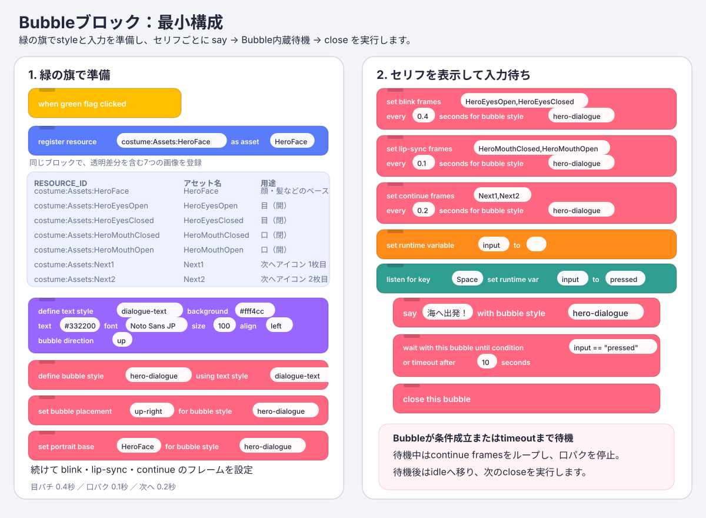
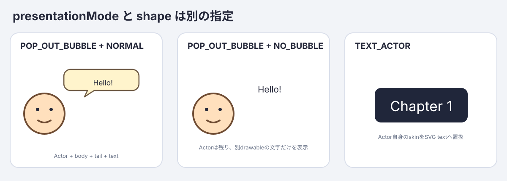
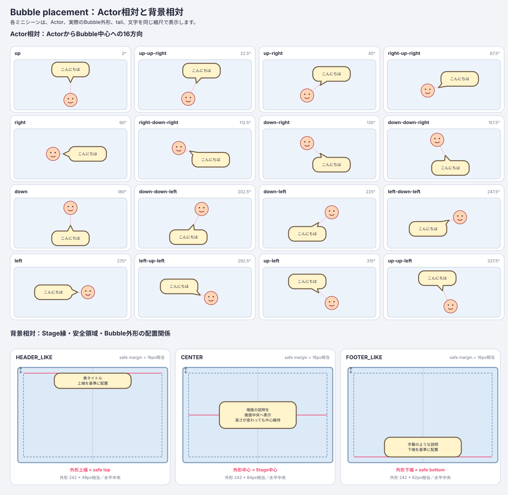
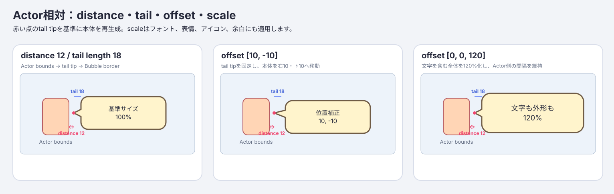
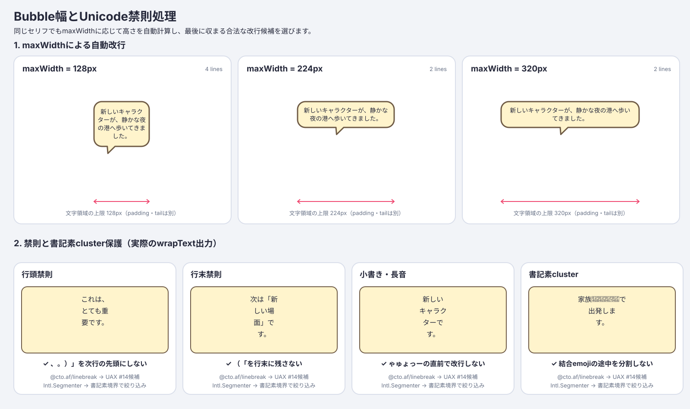
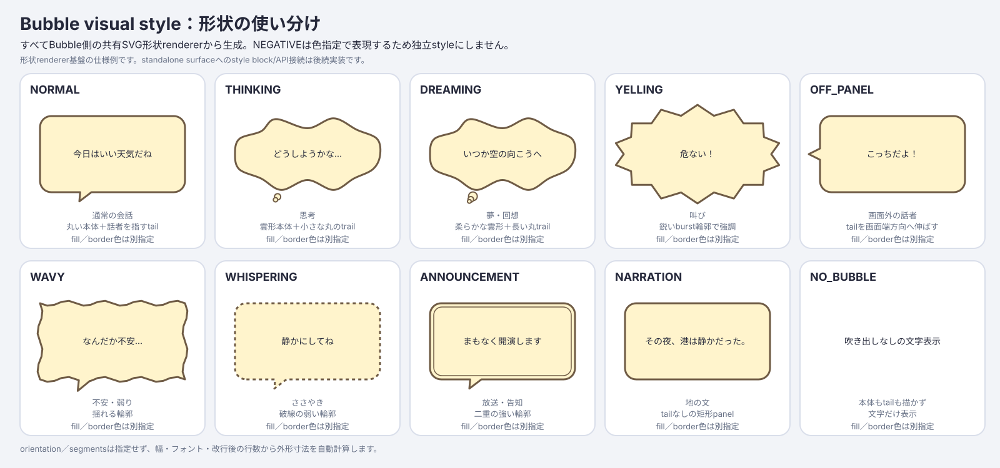
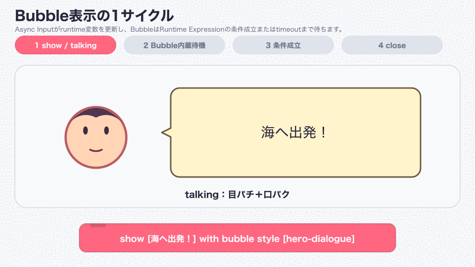
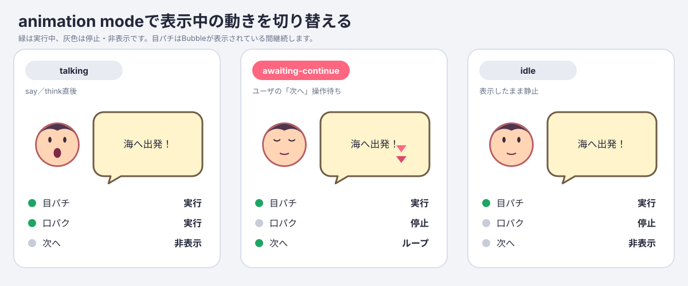

# TurboWarp Bubble ブロック利用マニュアル

このマニュアルでは、`turbowarp-bubble`をTurboWarpのカスタム拡張機能として使い、SVG本体、文字、キャラクター表情、目パチ、口パク、「次へ」アイコンを組み合わせたBubbleを表示します。



## 1. 必要な拡張機能

入力待ちを含む完全な例では5つの拡張機能を使います。TurboWarpの拡張機能ライブラリからTemporary Variablesを追加し、残る4つのカスタム拡張機能は「サンドボックスなしで実行」を許可して読み込みます。Async InputとRuntime Expressionが必要なのは内蔵待機ブロックだけです。Asset Managerが必要なのはportraitまたはadvance-frame画像を使う場合だけです。SVG Text engineはBubbleに内蔵されるため、SVG Text拡張を別途読み込みません。

| 順番 | 拡張機能                 | 読み込み先                                                                                               |
| ---: | ------------------------ | -------------------------------------------------------------------------------------------------------- |
|    1 | Temporary Variables      | TurboWarpの拡張機能ライブラリから追加                                                                    |
|    2 | Async Input 0.3.0        | `https://cdn.jsdelivr.net/npm/@kubohiroya/turbowarp-async-input@0.3.0/dist/async-input.js`               |
|    3 | Runtime Expression 0.3.0 | `https://cdn.jsdelivr.net/npm/@kubohiroya/turbowarp-runtime-expression@0.3.0/dist/runtime-expression.js` |
|    4 | Asset Manager 0.7.0      | `https://cdn.jsdelivr.net/npm/@kubohiroya/turbowarp-asset-manager@0.7.0/dist/asset-manager.js`           |
|    5 | Bubble 0.2.0             | npm公開後は`https://cdn.jsdelivr.net/npm/@kubohiroya/turbowarp-bubble@0.2.0/dist/turbowarp-bubble.js`    |

開発中のBubbleを試す場合は、このリポジトリの`dist/turbowarp-bubble.js`をローカルカスタム拡張機能として読み込みます。画像layerを使うときにAsset Managerがない場合、または待機開始時にAsync Input／Runtime Expressionがない場合は、Bubbleが必要な拡張名を含むerrorを返します。

参考：

- [Asset Manager 日本語ガイド](https://kubohiroya.github.io/turbowarp-asset-manager/ja/)
- [Async Input 日本語ガイド](https://kubohiroya.github.io/turbowarp-async-input/ja/)
- [Runtime Expression 日本語ガイド](https://kubohiroya.github.io/turbowarp-runtime-expression/ja/)

## 2. 表情画像を準備する

例では`Assets`という素材用spriteに、次のcostumeを入れます。素材用spriteは画面上で非表示でも構いません。

| costume           | Asset Managerへ登録する名前 | 内容                                             |
| ----------------- | --------------------------- | ------------------------------------------------ |
| `HeroFace`        | `HeroFace`                  | 顔、髪、輪郭などのベース。動かす目と口は含めない |
| `HeroEyesOpen`    | `HeroEyesOpen`              | 開いた目だけを描いた透明差分                     |
| `HeroEyesClosed`  | `HeroEyesClosed`            | 閉じた目だけを描いた透明差分                     |
| `HeroMouthClosed` | `HeroMouthClosed`           | 閉じた口だけを描いた透明差分                     |
| `HeroMouthOpen`   | `HeroMouthOpen`             | 開いた口だけを描いた透明差分                     |
| `Next1`           | `Next1`                     | 「次へ」アイコンの1枚目                          |
| `Next2`           | `Next2`                     | 「次へ」アイコンの2枚目                          |

ベース、目、口の画像は同じcanvasサイズと同じ中心位置で作ります。差分画像の背景は透明にしてください。位置やcanvasサイズが異なると、レイヤーを重ねたときに目や口がずれます。

Asset Managerのブロックで各costumeを登録します。

```text
register resource [costume:Assets:HeroFace] as asset [HeroFace]
register resource [costume:Assets:HeroEyesOpen] as asset [HeroEyesOpen]
register resource [costume:Assets:HeroEyesClosed] as asset [HeroEyesClosed]
register resource [costume:Assets:HeroMouthClosed] as asset [HeroMouthClosed]
register resource [costume:Assets:HeroMouthOpen] as asset [HeroMouthOpen]
register resource [costume:Assets:Next1] as asset [Next1]
register resource [costume:Assets:Next2] as asset [Next2]
```

URL画像を使う場合は、`RESOURCE_ID`へHTTPS URLを指定します。Bubbleに設定できるのは、Asset Managerへ登録済みでMIME typeが`image/*`のアセットだけです。

## 3. 文字styleを定義する

BubbleのBuilderブロックを使い、巨大な単一ブロックを使わずに名前付きstyleを定義します。

```text
begin text style [dialogue-text]
set text background color [#fff4cc]
set text color [#332200]
set text font [Noto Sans JP]
set text size [100] %
set text align [left]
save text style
```

`begin`はextension全体で1個の作業中draftを作成・置換します。`save`はimmutableなnamed styleとして保存し、draftを破棄します。別draftの開始時、project開始・停止時にも未保存変更を破棄します。文字styleとBubble styleはruntime状態なので、通常は緑の旗が押されたときに毎回定義します。

## 4. Bubble styleを定義する

まず、Bubble style名とSVG Textのstyle名を関連付けます。

```text
define bubble style [hero-dialogue] using text style [dialogue-text]
set presentation mode [POP_OUT_BUBBLE] for bubble style [hero-dialogue]
set bubble placement [up-right] for bubble style [hero-dialogue]
set bubble distance [12] for bubble style [hero-dialogue]
set bubble visual style [NORMAL] for bubble style [hero-dialogue]
set bubble tail length [18] for bubble style [hero-dialogue]
set bubble offset x [0] y [0] scale [100] % for bubble style [hero-dialogue]
```

### Presentation mode



`presentationMode`とSVG本体形状は別の指定です。

| presentation mode | shape        | 結果                                       |
| ----------------- | ------------ | ------------------------------------------ |
| `POP_OUT_BUBBLE`  | `NORMAL`など | Actorを維持して別drawableの吹き出しを表示  |
| `POP_OUT_BUBBLE`  | `NO_BUBBLE`  | 本体とtailなしで別drawableの文字だけを表示 |
| `TEXT_ACTOR`      | 適用外       | Actor自身の表示をresponsive SVG textへ置換 |

text actorはBubble styleを`TEXT_ACTOR`にして`say`／`think`を実行するか、直接ブロックで指定できます。

```text
set this sprite text [第1章] with text style [dialogue-text]
clear this sprite text
```

`TEXT_ACTOR`にはplacement、distance、tail、offset、visual shape、portrait、advance indicatorを指定できません。Bubbleは不整合な組み合わせを無視せずerrorにします。clear時は生成SVG skinを解放し、spriteの現在のcostumeを再適用します。

### Actor相対と背景相対のplacement



Actor相対の16方向は、各方向をActor、Bubble外形、tail、文字を含む独立したミニシーンで示しています。三角形tailの基部2点は実際の本体border上にあり、本体polygonとのJSClipper union後の単一pathを描くため、接合部に内部border線は残りません。

背景相対3図はStage外枠、安全領域、Bubble外形寸法、水平中央線、基準辺／中心を示します。外形はBubble側の共有`renderBubbleSvg`で生成しており、TurboWarp Editorで本体drawableを生成するrendererと同じです。

Actor相対では、Actor中心からBubble全体の中心へ向かう方向を指定します。menuには次の16正規方向があります。

```text
up / up-up-right / up-right / right-up-right
right / right-down-right / down-right / down-down-right
down / down-down-left / down-left / left-down-left
left / left-up-left / up-left / up-up-left
```

`north`、`north-northeast`、`northeast`などのcompass aliasも直接入力またはreporterから指定できます。数値はScratch方向と同じ0〜360度で、`0`は上、`90`は右、`180`は下、`270`は左、`360`は`0`へ正規化されます。任意角度は16方向へ丸めません。placementを設定しないstyleは`up-right`になります。

背景相対はActorから生える方向を持たず、Stage安全領域へ配置します。

| placement     | 配置                          |
| ------------- | ----------------------------- |
| `HEADER_LIKE` | Stage安全領域上部、水平中央   |
| `CENTER`      | Stage安全領域の水平・垂直中央 |
| `FOOTER_LIKE` | Stage安全領域下部、水平中央   |

背景相対placementはActorの座標、bounds、可視性に依存しません。Stageから`say`／`think`を実行する場合も、この3値のいずれかを設定します。背景相対のBubble bodyにはActorを指すtailを描画しません。

### Actorとの距離、tail、本体の位置・拡大率



- `distance`（既定`12`）はActor boundsからtail先端までの距離です。Actor boundsとは、描画済みActorをStage座標で囲むAABB（上下左右のbounding box）です。
- `tail length`（既定`18`）は通常位置におけるBubble borderからtail先端までの基準長です。
- `offset x/y/scale`（既定`[0, 0, 100]`）は、xが右正、yが上正、scaleが百分率です。`[10, -10, 120]`なら、本体を右10・下10へ補正し、120%にします。

scaleは外形だけでなく、SVG Textの文字、表情ベース・目パチ・口パク、次へアイコン、内部余白へ一体で適用されるため、表示上のフォントサイズも同じ比率で変わります。scaleだけを変更すると、本体中心を拡大半径分だけActorから離してActor側の間隔を維持します。x/y offsetはその後に加算し、tail先端を固定したまま本体borderとのunionを再生成するため、offset後のtail実長は基準値から変化します。

Stage端では、拡大後のBubble全体を画面内へ収めるクランプが優先されるため、指定距離を保てない場合があります。背景相対の`HEADER_LIKE`／`CENTER`／`FOOTER_LIKE`では、これらのActor相対設定を使用しません。

### 幅・自動改行・禁則処理



図の改行結果はproductionの`wrapText`を直接実行して生成しています。`@cto.af/linebreak`がUnicode UAX #14の改行候補を返し、`Intl.Segmenter`の書記素境界で絞り込んだ後、実測幅の上限に収まる最後の候補を選びます。句読点、閉じ括弧、小書き仮名、長音、結合emojiの途中で不自然に分割しません。

### Bubble visual styleの形状例



形状候補は`NORMAL`、`THINKING`、`DREAMING`、`YELLING`、`OFF_PANEL`、`WAVY`、`WHISPERING`、`ANNOUNCEMENT`、`NARRATION`、`NO_BUBBLE`です。次のblockでBubble styleごとに選択します。

```text
set bubble visual style [YELLING] for bubble style [hero-dialogue]
```

図とTurboWarp Editorの本体drawableはBubble側の共有`renderBubbleSvg`から生成しています。三角形tailを持つ形状は[platener/jsclipper](https://github.com/platener/jsclipper)による本体との和集合です。`THINKING`／`DREAMING`は丸trailのためunion対象外です。Actor相対ではActorを向くtailを生成し、背景相対ではtailを付けません。`NO_BUBBLE`では本体drawableを非表示にして文字・表情などだけを表示します。

visual styleを省略した場合は`NORMAL`です。本体drawableは文字・portraitより先に生成して背面へ置きます。`close this bubble`、対象sprite／cloneの停止、runtime破棄時には、本体drawableとBubbleが所有するSVG skinも解放します。

`NEGATIVE`はfill colorとborder colorで表現できるため独立styleにはしません。orientationとsegmentsも公開入力にせず、幅、フォント、文字数、禁則処理後の行数から外形寸法を自動計算する方針です。

続けて、表情レイヤーと入力待ちアイコンを設定します。

```text
set portrait base [HeroFace] for bubble style [hero-dialogue]

set blink frames [HeroEyesOpen,HeroEyesClosed]
  every [0.4] seconds for bubble style [hero-dialogue]

set talk frames [HeroMouthClosed,HeroMouthOpen]
  every [0.1] seconds for bubble style [hero-dialogue]

set advance frames [Next1,Next2]
  every [0.2] seconds for bubble style [hero-dialogue]
```

`ASSETS`はカンマ区切りのAsset Managerアセット名です。名前の前後の空白は除去されます。アセット名自体にカンマは使用できません。

- 目パチと口パクは1枚以上指定できます。1枚だけなら表示は固定されます。
- 「次へ」はループが分かるよう2枚以上必要です。
- `SECONDS`は0より大きい秒数です。
- `ASSETS`を空にすると、そのアニメーション設定を解除します。
- 表情ベースを空にするとportrait全体を解除します。

## 5. セリフを表示して入力を待つ

`say`または`think`はBubbleを表示するとすぐ次のブロックへ進み、初期animation modeは`talking`になります。

```text
set runtime variable [input] to []
listen for key [Space] set runtime var [input] to [pressed]
listen for touch on this sprite set runtime var [input] to [pressed]
say [海へ出発！] with bubble style [hero-dialogue]
wait with this bubble until condition [input == "pressed"] or timeout after [10] seconds
close this bubble
```

まずTemporary Variablesで`input`を初期化してから、Async Inputのキー入力とタップのlistenerを登録します。Bubbleの待機ブロックは、`input == "pressed"`をRuntime Expressionへ委譲し、開始直後とVMの各フレームで評価します。待機中は自動的に`awaiting-advance`となり、口パクを停止して`set advance frames`の画像をループします。条件成立またはtimeout後は`idle`へ移り、次の`close this bubble`へ進みます。timeoutを`0`にすると時間制限なしです。

次の待機に入る前に`input`を空文字へ戻してください。前回の`pressed`が残っていると、次の条件が直ちに成立します。別のBubble表示、close、対象targetの停止、projectの開始・停止、runtime破棄では、targetが所有する待機とlistener、timerをキャンセルして解放します。

音声再生や別の文字送り処理と組み合わせる場合は、それらが完了した時点で`awaiting-advance`へ切り替えます。



アニメーションGIFを再生できない環境では、次の比較図で各animation modeを確認できます。



## 6. Animation modeの使い分け

| mode               | 目パチ | 口パク       | advance frames | 主な用途                     |
| ------------------ | ------ | ------------ | -------------- | ---------------------------- |
| `talking`          | 実行   | 実行         | 非表示         | セリフ表示中、音声再生中     |
| `awaiting-advance` | 実行   | 停止・非表示 | ループ         | ユーザによる「次へ」操作待ち |
| `idle`             | 実行   | 停止・非表示 | 停止・非表示   | Bubbleを表示したまま静止     |

`set this bubble animation mode [MODE]`は、呼び出したsprite、clone、またはStageが所有するBubbleだけを変更します。先に`say`または`think`を実行していない場合はエラーになります。

## 7. sayとthink

```text
say [MESSAGE] with bubble style [STYLE]
think [MESSAGE] with bubble style [STYLE]
```

どちらも同じvisual style、表情レイヤー、placement、animation mode制御を使えます。`say`／`think`だけで形状を固定せず、`set bubble visual style`で`NORMAL`、`THINKING`などを明示的に選びます。Composition APIのsurfaceには`say`／`think`のkindも渡されるため、独自hostではkindに応じた追加表現も可能です。

同じsprite、clone、またはStageで新しい`say`／`think`を実行すると、以前のBubbleをtimerやdrawableごと破棄してから置き換えます。Stageでは背景相対placementだけを使用できます。

## 8. cloneで使う

Bubble styleの定義は拡張機能内で共有されますが、表示中のBubbleはsprite／cloneごとに所有されます。

1. 元spriteで、緑の旗が押されたときにアセットとstyleを1回定義します。
2. 各clone自身から`say`または`think`を実行します。
3. animation mode変更とcloseも、表示したのと同じcloneから実行します。

cloneが停止・削除された場合は、そのtargetに属するtimer、SVG Text skin、drawableが自動解放されます。

## 9. ブロック一覧

| ブロック                                                                               | 説明                                                   |
| -------------------------------------------------------------------------------------- | ------------------------------------------------------ |
| `begin text style [STYLE]`                                                             | 作業中の文字style draftを開始・置換する                |
| `set text font/size/color/background/align ...`                                        | 作業中の文字style draftへ設定を加える                  |
| `save text style`                                                                      | named styleを保存してdraftを破棄する                   |
| `define bubble style [STYLE] using text style [TEXT_STYLE]`                            | Bubble styleを定義または再定義する                     |
| `set presentation mode [MODE] for bubble style [STYLE]`                                | `POP_OUT_BUBBLE`または`TEXT_ACTOR`を選ぶ               |
| `set bubble placement [PLACEMENT] for bubble style [STYLE]`                            | Actor相対方向・角度、または背景相対領域を設定する      |
| `set bubble distance [DISTANCE] for bubble style [STYLE]`                              | Actor boundsからtail先端までの距離を設定する           |
| `set bubble visual style [VISUAL_STYLE] for bubble style [STYLE]`                      | Bubble本体のSVG形状を10種類から設定する                |
| `set bubble tail length [LENGTH] for bubble style [STYLE]`                             | Bubble borderからtail先端までの基準長を設定する        |
| `set bubble offset x [X] y [Y] scale [SCALE] % for bubble style [STYLE]`               | 本体位置と、文字を含む全体のscaleを設定する            |
| `set portrait base [ASSET] for bubble style [STYLE]`                                   | portraitのベース画像を設定する                         |
| `set blink frames [ASSETS] every [SECONDS] seconds for bubble style [STYLE]`           | 目パチ差分と間隔を設定する                             |
| `set talk frames [ASSETS] every [SECONDS] seconds for bubble style [STYLE]`            | 口パク差分と間隔を設定する                             |
| `set advance frames [ASSETS] every [SECONDS] seconds for bubble style [STYLE]`         | `awaiting-advance`中の「次へ」アニメーションを設定する |
| `say [MESSAGE] with bubble style [STYLE]`                                              | `talking` modeでsay表示を開始・置換する                |
| `think [MESSAGE] with bubble style [STYLE]`                                            | `talking` modeでthink表示を開始・置換する              |
| `set this sprite text [TEXT] with text style [STYLE]`                                  | sprite自身の表示をSVG textへ置換する                   |
| `clear this sprite text`                                                               | SVG textを解放して現在のcostumeを復元する              |
| `set this bubble animation mode [MODE]`                                                | `talking`、`awaiting-advance`、`idle`からmodeを選ぶ    |
| `wait with this bubble until condition [CONDITION] or timeout after [TIMEOUT] seconds` | Runtime Expressionの条件成立またはtimeoutまで待つ      |
| `close this bubble`                                                                    | 自分のBubbleと所有resourceを解放する                   |
| `Bubble version`                                                                       | Bubble実装versionを返す                                |

## 10. よくあるエラー

| 状況                               | 原因と対処                                                               |
| ---------------------------------- | ------------------------------------------------------------------------ |
| Asset Managerを要求するエラー      | Asset Manager 0.7.xをサンドボックスなしで読み込む                        |
| Async Inputを要求するエラー        | Bubble待機より前にAsync Input 0.3.xをサンドボックスなしで読み込む        |
| Runtime Expressionを要求するエラー | Bubble待機より前にRuntime Expression 0.3.xをサンドボックスなしで読み込む |
| `bubble style is not defined`      | `define bubble style`を先に実行する。緑の旗の再実行時も再定義する        |
| image assetが未登録                | `register resource ... as asset ...`の完了後にBubbleを表示する           |
| assetが画像ではない                | `MIME type of asset [NAME]`で`image/*`か確認する                         |
| advance framesが1枚                | 2枚以上にするか、空にしてadvance表示を解除する                           |
| frame intervalエラー               | `SECONDS`を0より大きい有限値にする                                       |
| StageからActor相対表示した         | placementを`HEADER_LIKE`、`CENTER`、`FOOTER_LIKE`にする                  |
| `TEXT_ACTOR does not accept...`    | popup専用設定を除くか`POP_OUT_BUBBLE`を使う                              |
| placementが不正                    | 16方向、alias、0〜360度、背景相対3値のいずれかを指定する                 |
| 目や口がずれる                     | ベースと全差分のcanvasサイズ、中心、透明領域を揃える                     |

## 11. 自動解放されるタイミング

次の場合、Bubbleが所有するtimer、SVG Text skin、renderer drawableは自動的に解放されます。

- `close this bubble`
- 同じsprite／cloneで次の`say`または`think`を実行したとき
- 対象sprite／cloneが停止したとき
- 緑の旗によるproject開始
- projectの全停止
- TurboWarp runtimeの破棄

Asset Managerへ登録したアセット自体はBubbleの所有物ではありません。不要になった登録画像をメモリから削除する場合は、Bubbleを閉じた後にAsset Managerの`delete asset [NAME] from memory`を使います。

## 12. マニュアル画像の再生成

図とGIFはリポジトリ内のスクリプトから再生成できます。GIF生成にはImageMagickの`magick`コマンドが必要です。

```sh
pnpm docs:render
pnpm docs:check
```

`docs:check`は、SVGのviewBox、production renderer／wrapText由来marker、全visual style、GIFの寸法・16フレーム・ループ設定、マニュアルから画像と全16ブロックへの参照、およびPages用HTMLが最新であることを検証します。
