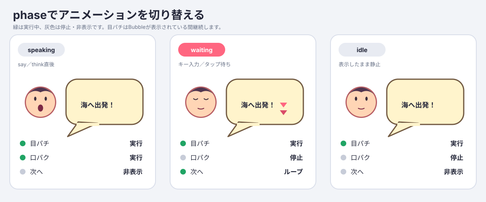

# TurboWarp Bubble Block Manual

This manual explains how to use `turbowarp-bubble` as an unsandboxed TurboWarp custom extension. A Bubble combines an SVG body, text, a character portrait, blinking and lip-sync layers, and an animated advance indicator.


## 1. Load the required extensions

Load all three extensions with **Run without sandbox** enabled. The recommended order is Asset Manager, SVG Text, then Bubble. In practice, both dependencies only need to be available before the first Bubble is shown.

| Order | Extension           | URL                                                                                                               |
| ----: | ------------------- | ----------------------------------------------------------------------------------------------------------------- |
|     1 | Asset Manager 0.7.0 | `https://cdn.jsdelivr.net/npm/@kubohiroya/turbowarp-asset-manager@0.7.0/dist/asset-manager.js`                    |
|     2 | SVG Text 0.3.0      | `https://cdn.jsdelivr.net/npm/@kubohiroya/turbowarp-svg-text@0.3.0/dist/svg-text.js`                              |
|     3 | Bubble 0.1.0        | After npm publication: `https://cdn.jsdelivr.net/npm/@kubohiroya/turbowarp-bubble@0.1.0/dist/turbowarp-bubble.js` |

To try a development build, load this repository's `dist/turbowarp-bubble.js` as a local custom extension. Bubble reports an explicit error if Asset Manager or SVG Text is missing when it tries to display a Bubble.

See also:

- [Asset Manager guide](https://kubohiroya.github.io/turbowarp-asset-manager/)
- [SVG Text guide](https://kubohiroya.github.io/turbowarp-svg-text/)

## 2. Prepare portrait assets

The following example stores costumes in a hidden asset sprite named `Assets`.

| Costume           | Asset Manager name | Contents                                                   |
| ----------------- | ------------------ | ---------------------------------------------------------- |
| `HeroFace`        | `HeroFace`         | Face, hair, and outline, excluding the animated eyes/mouth |
| `HeroEyesOpen`    | `HeroEyesOpen`     | Transparent overlay containing only the open eyes          |
| `HeroEyesClosed`  | `HeroEyesClosed`   | Transparent overlay containing only the closed eyes        |
| `HeroMouthClosed` | `HeroMouthClosed`  | Transparent overlay containing only the closed mouth       |
| `HeroMouthOpen`   | `HeroMouthOpen`    | Transparent overlay containing only the open mouth         |
| `Next1`           | `Next1`            | First frame of the advance indicator                       |
| `Next2`           | `Next2`            | Second frame of the advance indicator                      |

Use the same canvas size and center point for the base, eye, and mouth images. Keep overlay backgrounds transparent; mismatched canvases or centers make the layers drift when composed.

Register each costume with Asset Manager:

```text
register resource [costume:Assets:HeroFace] as asset [HeroFace]
register resource [costume:Assets:HeroEyesOpen] as asset [HeroEyesOpen]
register resource [costume:Assets:HeroEyesClosed] as asset [HeroEyesClosed]
register resource [costume:Assets:HeroMouthClosed] as asset [HeroMouthClosed]
register resource [costume:Assets:HeroMouthOpen] as asset [HeroMouthOpen]
register resource [costume:Assets:Next1] as asset [Next1]
register resource [costume:Assets:Next2] as asset [Next2]
```

For a remote image, pass its HTTPS URL as `RESOURCE_ID`. Bubble accepts only assets already registered with Asset Manager whose MIME type is `image/*`.

## 3. Define a text style

Use SVG Text to define the named style for the Bubble's text layer.

```text
define text style [dialogue-text]
  background [#fff4cc]
  text [#332200]
  font [Noto Sans JP]
  size [100]
  align [left]
  bubble direction [up]
```

Bubble refers to this style as `dialogue-text`. Text and Bubble styles are runtime state, so normally define them again whenever the green flag is clicked.

SVG Text 0.3.x retains a `bubble direction` input in its block contract, but Bubble does not use it when creating the text drawable through `setText`. Use `set bubble placement` in the next section instead. The obsolete SVG Text direction input is intended to be removed in a later breaking release.

## 4. Define a Bubble style

First associate a Bubble style name with an SVG Text style name.

```text
define bubble style [hero-dialogue] using text style [dialogue-text]
set bubble placement [up-right] for bubble style [hero-dialogue]
set bubble distance [12] for bubble style [hero-dialogue]
set bubble visual style [NORMAL] for bubble style [hero-dialogue]
set bubble tail length [18] for bubble style [hero-dialogue]
set bubble offset x [0] y [0] scale [100] % for bubble style [hero-dialogue]
```

### Actor-relative and stage-relative placement


Each of the 16 actor-relative directions is shown as a complete mini-scene containing an actor, Bubble body, tail, and text. The two tail-base points lie on the body border. The renderer uses a JSClipper union to produce a single path, so no internal border remains at the join.

The three stage-relative diagrams show the Stage frame, safe area, Bubble dimensions, horizontal centerline, and relevant reference edge or center. The diagrams and the TurboWarp drawable are generated by the same shared `renderBubbleSvg` implementation.

Actor-relative placement specifies the direction from the actor's center toward the center of the entire Bubble. The menu provides these 16 canonical directions:

```text
up / up-up-right / up-right / right-up-right
right / right-down-right / down-right / down-down-right
down / down-down-left / down-left / left-down-left
left / left-up-left / up-left / up-up-left
```

Compass aliases such as `north`, `north-northeast`, and `northeast` may also be typed directly or supplied by a reporter. A number uses Scratch direction semantics from 0 through 360 degrees: `0` is up, `90` right, `180` down, `270` left, and `360` normalizes to `0`. Arbitrary angles are not rounded to the 16 menu directions. The default is `up-right`.

Stage-relative placements do not point at an actor and are positioned within the Stage safe area.

| Placement     | Position                                    |
| ------------- | ------------------------------------------- |
| `HEADER_LIKE` | Top of the Stage safe area, centered        |
| `CENTER`      | Horizontal and vertical center of the Stage |
| `FOOTER_LIKE` | Bottom of the Stage safe area, centered     |

These placements do not depend on actor coordinates, bounds, or visibility. Use one of them when running `say` or `think` from the Stage. A stage-relative Bubble has no actor-pointing tail.

### Actor distance, tail, body offset, and scale


- `distance` (default `12`) is the gap between the actor bounds and the tail tip. Actor bounds means the axis-aligned bounding box (AABB) of the rendered actor in Stage coordinates.
- `tail length` (default `18`) is the nominal distance from the Bubble border to the tail tip at the normal position.
- `offset x/y/scale` (default `[0, 0, 100]`) uses positive x to the right, positive y upward, and scale as a percentage. `[10, -10, 120]` moves the body 10 right and 10 down, then scales it to 120%.

Scale applies to the body, SVG Text, portrait base, blink/lip-sync layers, advance indicator, and internal padding as one unit, so the displayed font size scales by the same factor. When scale alone changes, the body center moves away from the actor by the increase in radius, preserving the actor-side gap. The x/y offset is added afterward. The tail tip remains fixed and the union with the body border is regenerated, so an offset can change the effective tail length.

Near a Stage edge, keeping the scaled Bubble on-screen takes priority and can reduce the requested distance. Actor-relative distance, tail, offset, and scale settings do not apply to `HEADER_LIKE`, `CENTER`, or `FOOTER_LIKE`.

### Width, automatic wrapping, and Japanese line-breaking rules


The diagram is generated by running the production `wrapText` implementation. `@cto.af/linebreak` supplies Unicode UAX #14 break opportunities, which are filtered against `Intl.Segmenter` grapheme boundaries. The renderer then chooses the last candidate that fits the measured width. It avoids unnatural breaks before punctuation, closing brackets, small kana and prolonged sound marks, and inside a combined emoji grapheme.

### Bubble visual styles


Available shapes are `NORMAL`, `THINKING`, `DREAMING`, `YELLING`, `OFF_PANEL`, `WAVY`, `WHISPERING`, `ANNOUNCEMENT`, `NARRATION`, and `NO_BUBBLE`.

```text
set bubble visual style [YELLING] for bubble style [hero-dialogue]
```

The diagram and TurboWarp drawable both use Bubble's shared `renderBubbleSvg` function. Shapes with triangular tails use a [platener/jsclipper](https://github.com/platener/jsclipper) union between the body and tail. `THINKING` and `DREAMING` use circular trails and are excluded from that union. Actor-relative placement points the tail toward the actor; stage-relative placement has no tail. `NO_BUBBLE` hides the body drawable and displays only text, portrait, and other layers.

The default visual style is `NORMAL`. The body drawable is created before text and portrait drawables so it remains behind them. `close this bubble`, target/clone disposal, and runtime disposal release the body drawable and its owned SVG skin.

`NEGATIVE` is not a separate style because it can be expressed with fill and border colors. Orientation and segments are also not public inputs; dimensions are calculated from width, font, character count, and the number of lines after wrapping.

Now configure the portrait and advance animation layers:

```text
set portrait base [HeroFace] for bubble style [hero-dialogue]

set blink frames [HeroEyesOpen,HeroEyesClosed]
  every [0.4] seconds for bubble style [hero-dialogue]

set talk frames [HeroMouthClosed,HeroMouthOpen]
  every [0.1] seconds for bubble style [hero-dialogue]

set advance frames [Next1,Next2]
  every [0.2] seconds for bubble style [hero-dialogue]
```

`ASSETS` is a comma-separated list of Asset Manager names. Surrounding whitespace is removed; commas cannot be part of an asset name.

- Blink and talk animations accept one or more frames. A single frame remains static.
- Use two or more advance frames so the loop is visible.
- `SECONDS` must be a finite number greater than zero.
- An empty `ASSETS` input removes that animation.
- An empty portrait base removes the whole portrait.

## 5. Show dialogue and wait for input

`say` and `think` show a Bubble immediately, continue to the next block, and begin in the `speaking` phase.

```text
say [Let's head for the sea!] with bubble style [hero-dialogue]
set this bubble phase [waiting]
wait until <space key pressed? or mouse down?>
close this bubble
```

Changing to `waiting` stops lip-sync and loops the advance indicator. Bubble does not decide when key input, a tap, or text reveal has completed. Wait with ordinary Scratch/TurboWarp blocks, then run `close this bubble` after input is accepted.

When combining Bubble with audio or a separate text-reveal system, switch to `waiting` when that process completes.


If animated GIF playback is unavailable, use this static phase comparison:



## 6. Bubble phases

| Phase      | Blink | Lip-sync     | Advance indicator | Typical use                        |
| ---------- | ----- | ------------ | ----------------- | ---------------------------------- |
| `speaking` | Runs  | Runs         | Hidden            | Dialogue display or audio playback |
| `waiting`  | Runs  | Stops/hidden | Loops             | Waiting for a key press or tap     |
| `idle`     | Runs  | Stops/hidden | Stops/hidden      | Keep a Bubble visible and still    |

`set this bubble phase [PHASE]` changes only the Bubble owned by the calling sprite, clone, or Stage. It reports an error if that target has not first run `say` or `think`.

## 7. `say` and `think`

```text
say [MESSAGE] with bubble style [STYLE]
think [MESSAGE] with bubble style [STYLE]
```

Both blocks support the same visual styles, portrait layers, placement, and phase control. The block name does not force a shape; explicitly choose `NORMAL`, `THINKING`, or another shape with `set bubble visual style`. The Composition API surface still receives a `say`/`think` kind, so a custom host can add its own kind-dependent behavior.

Running a new `say` or `think` on the same sprite, clone, or Stage disposes the previous Bubble and its timers/drawables before replacing it. The Stage supports stage-relative placement only.

## 8. Using Bubble with clones

Bubble style definitions are shared within the extension, but each sprite or clone owns its currently displayed Bubble.

1. Define assets and styles once from the original sprite when the green flag is clicked.
2. Run `say` or `think` from each clone itself.
3. Change the phase and close the Bubble from the same clone that displayed it.

When a clone stops or is deleted, timers, SVG Text skins, and renderer drawables owned by that target are released automatically.

## 9. Block reference

| Block                                                                          | Description                                                  |
| ------------------------------------------------------------------------------ | ------------------------------------------------------------ |
| `define bubble style [STYLE] using text style [TEXT_STYLE]`                    | Define or redefine a Bubble style                            |
| `set bubble placement [PLACEMENT] for bubble style [STYLE]`                    | Set an actor direction/angle or a stage-relative region      |
| `set bubble distance [DISTANCE] for bubble style [STYLE]`                      | Set the distance from actor bounds to the tail tip           |
| `set bubble visual style [VISUAL_STYLE] for bubble style [STYLE]`              | Select one of ten SVG body shapes                            |
| `set bubble tail length [LENGTH] for bubble style [STYLE]`                     | Set the nominal border-to-tip tail length                    |
| `set bubble offset x [X] y [Y] scale [SCALE] % for bubble style [STYLE]`       | Set body position and whole-Bubble scale, including text     |
| `set portrait base [ASSET] for bubble style [STYLE]`                           | Set the portrait base image                                  |
| `set blink frames [ASSETS] every [SECONDS] seconds for bubble style [STYLE]`   | Set blink overlays and interval                              |
| `set talk frames [ASSETS] every [SECONDS] seconds for bubble style [STYLE]`    | Set lip-sync overlays and interval                           |
| `set advance frames [ASSETS] every [SECONDS] seconds for bubble style [STYLE]` | Set the advance animation shown during `waiting`             |
| `say [MESSAGE] with bubble style [STYLE]`                                      | Start or replace a `say` Bubble in the `speaking` phase      |
| `think [MESSAGE] with bubble style [STYLE]`                                    | Start or replace a `think` Bubble in the `speaking` phase    |
| `set this bubble phase [PHASE]`                                                | Set this target's Bubble to `speaking`, `waiting`, or `idle` |
| `close this bubble`                                                            | Release this target's Bubble and owned resources             |
| `Bubble version`                                                               | Report the Bubble implementation version                     |

## 10. Troubleshooting

| Symptom                              | Cause and solution                                                          |
| ------------------------------------ | --------------------------------------------------------------------------- |
| Asset Manager required error         | Load Asset Manager 0.7.x without sandbox                                    |
| SVG Text required error              | Load SVG Text 0.3.x without sandbox                                         |
| `bubble style is not defined`        | Run `define bubble style` first, including after restarting with green flag |
| Image asset is not registered        | Wait for `register resource ... as asset ...` before showing the Bubble     |
| Asset is not an image                | Confirm `MIME type of asset [NAME]` is `image/*`                            |
| Only one advance frame               | Supply at least two frames, or clear the setting                            |
| Frame interval error                 | Use a finite `SECONDS` value greater than zero                              |
| Actor-relative Bubble from the Stage | Use `HEADER_LIKE`, `CENTER`, or `FOOTER_LIKE`                               |
| Invalid placement                    | Use a 16-way direction, alias, 0–360 degree angle, or stage-relative value  |
| Eyes or mouth are misaligned         | Match canvas size, center, and transparent area across all portrait layers  |

## 11. Automatic cleanup

Bubble automatically releases its owned timers, SVG Text skins, and renderer drawables when:

- `close this bubble` runs;
- the same sprite or clone runs another `say` or `think`;
- the target sprite or clone stops;
- the green flag starts the project;
- the whole project stops; or
- the TurboWarp runtime is disposed.

Assets registered with Asset Manager are not owned by Bubble. To remove an unused registered image from memory, close the Bubble first and then use Asset Manager's `delete asset [NAME] from memory` block.

## 12. Regenerating the manual assets

The diagrams and GIF are generated from scripts in this repository. GIF generation requires the ImageMagick `magick` command.

```sh
pnpm docs:render
pnpm docs:check
```

`docs:check` verifies SVG viewBoxes, production-renderer and `wrapText` markers, every visual style, the GIF dimensions/frame count/loop setting, references to all images and 15 blocks in both language manuals, and that the generated GitHub Pages HTML is current.
